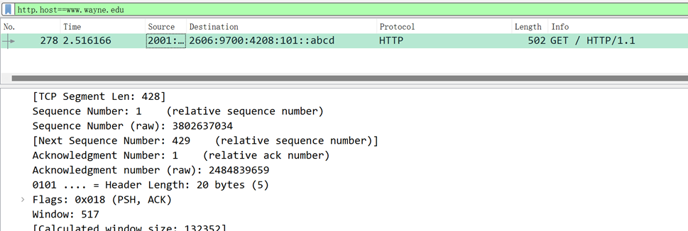
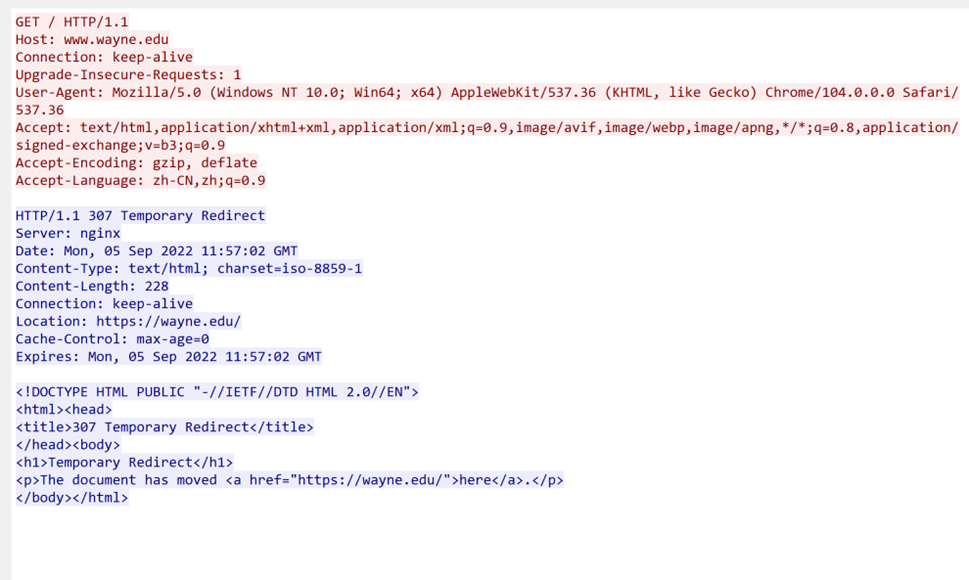
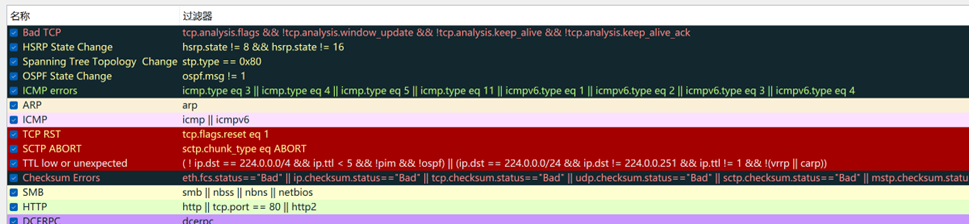
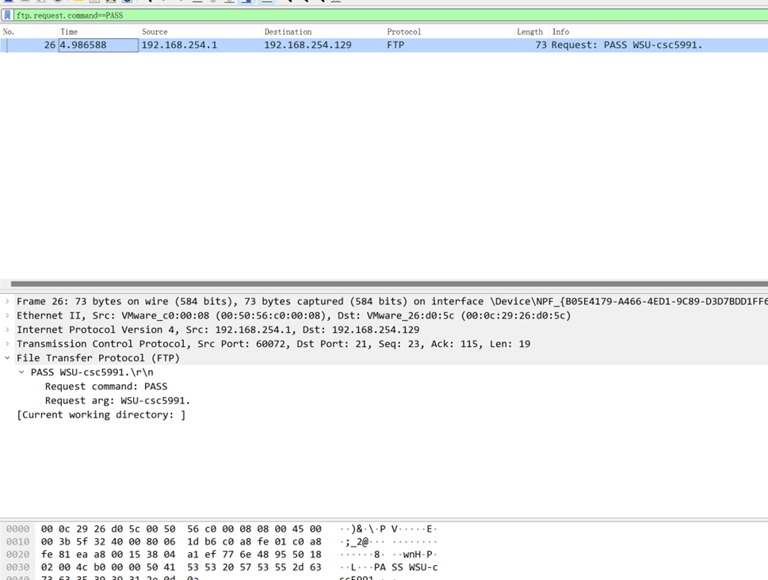

# 第一周lab报告

## 1. Carefully read the lab instructions and finish all tasks above.
After follow all instructions, some of important screenshots as below

## 2. If a packet is highlighted by black, what does it mean for the packet?
Choice 视图->着色规则 Then filter of every color will be shown below:

So highlighted by black just means the packet matches above filters.  
**Reason(name) and Detail(filter)** is shown in above screenshot.  
Simply, those are corrupt packages, e.g. status shows error, not pass crc check, etc..

## 3. What is the filter command for listing all outgoing http traffic?
Use `tcp.dstport==80` is not good enough, since http service can run on other ports, e.g. 8080, 443, 8000  

However using `ip.src==[YourIP]` May lost those ipv6 requests.    

We know MAC is lower than TCP/IP stack, so use MAC is a great choice:  
`eth.src == [Your-MAC] && http`  
this can ensure outgoing http package and including both ipv4 and ipv6 requests.

## 4. Why does DNS use Follow UDP Stream while HTTP use Follow TCP Stream?
Since DNS use `User Datagram Protocol (UDP)` to handle DNS requests.  
And HTTP use `tcp socket` to transfer data.

## 5. Using Wireshark to capture the FTP password

Use filter `ftp.request.command==PASS` to get the package that have password

