`注①：我的开发环境是Android Studio Dolphin | 2021.3.1 Patch 1，官方提供的Demo代码和pdf有部分差别。`  
`注②：因为没有明确的法律保证逆向工作的合法性，我在可选部分中隐去了公司的名称和部分细节。`


按照课件要求编译，并在Android Studio的模拟器上运行。
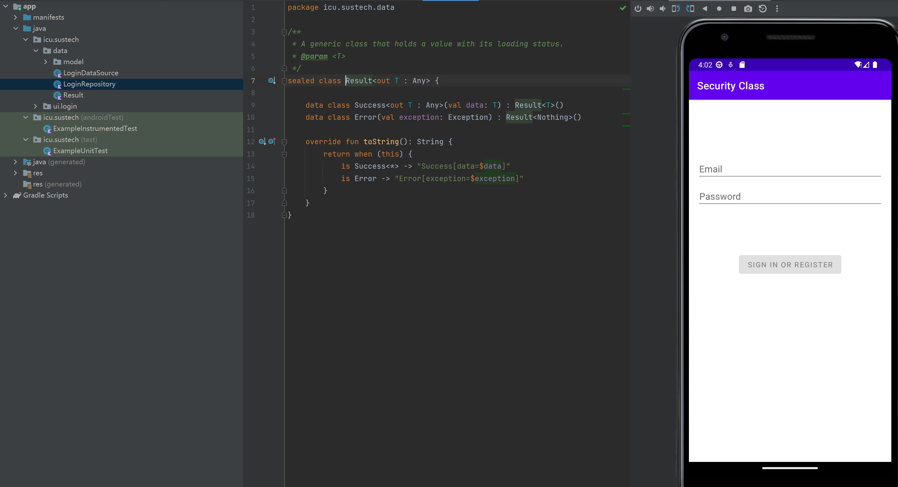  

接下来要patch并重打包APK，我常用的安卓java层逆向工具有`JEB`, `Jadx`, `MT编辑器`, `APK-Tools`，我认为本次lab用`MT编辑器`完成所有操作是相对方便快捷的。

我决定在`LoginDataSource`中插入如下恶意log代码完成log：
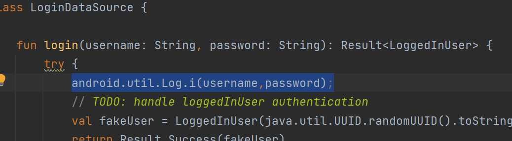  
首先逆向apk的`classes.dex`文件，定位到函数开头：
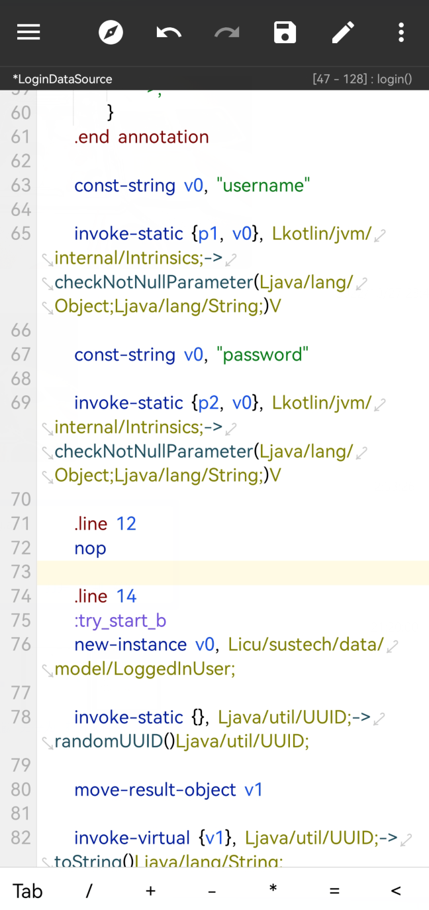  
接下来插入Smail语法的指令`invoke-static {p1, p2}, Landroid/util/Log;->i(Ljava/lang/String;Ljava/lang/String;)I
`：
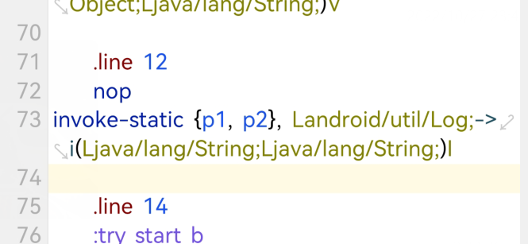  
保存并打包，别问我为什么这一步不给截图，这里点击右上角保存按钮就可以了。  
然后可以看到此时APK因为dex文件被修改，签名校验不通过。
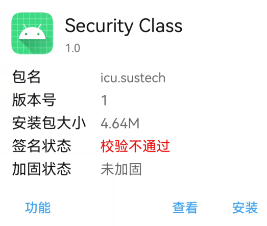  
MT管理器的重签名功能比课件中的方法强大很多，适用于现代的APK。
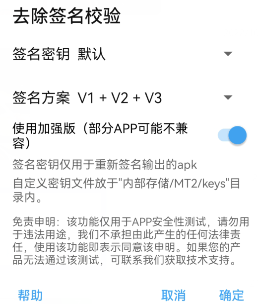  
签名后可以正常安装：
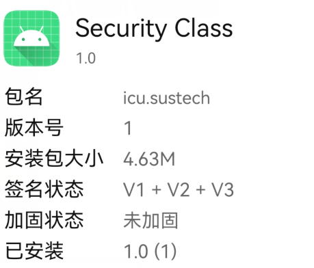  
因为是自己编译的应用，我直接在真机上安装并运行，这是patch并打包后的APK运行界面：
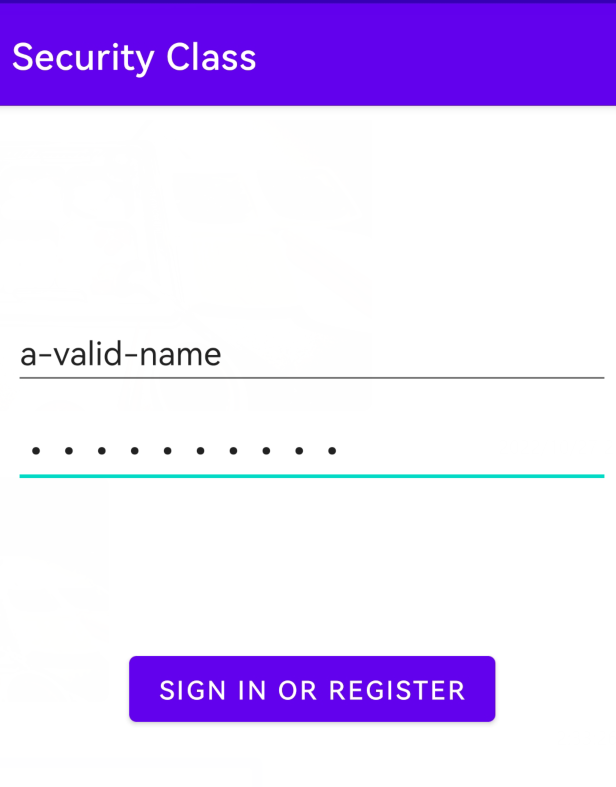  
真机连接ADB，在`adb logcat`的输出中可以找到被成功写入log的用户名和密码。
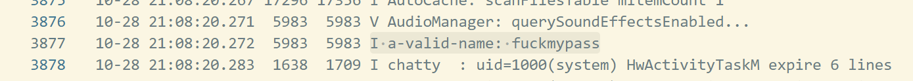  

## 任务
### Read the lab instructions above and finish all the tasks
### Turn in the file name and entire smali method that you modified to write the username and password to the log from the Login App.
### Turn in a screenshot of the captured username and password
请见上文正文

### Describe the process to obfuscate an Android Application
一般来说，安卓应用的混淆我们称为加固或者加壳。主要有两大工作方向：
- java层加固，通过传统的java混淆方式，如反射，构造畸形命名等
- so层加固，也是目前主流的安卓加固方式，即静态程序只存在加密的dex代码，字节码抽取后的dex只暴露调用JNI的入口函数，在编译成native的so中解密还原dex。对直接编译到二进制的so文件可以使用传统的二进制混淆方式，如加壳加花反调试,SMC,OLLVM,VMP等

加固本身之外，值得一提的是**插暗桩**进行完整性自校验。  
暗桩的一个功能是校验自身完整性，比如计算自身sha256并和服务器返回值对比，如果发现不同就将自身的安装包发回服务器，**开发者就可以知道自己的应用已经被恶意逆向并重打包了**，更有甚者可以顺带返回手机机主的个人信息，比如设备型号，SIM卡号码等，方便快速溯源逆向者。  
这些暗桩混迹在看似正常的代码中，比如UI缩放处理函数中。暗桩的技术被广泛应用在高价值的商业应用中，比如手机QQ（快去试一试，然后喜提封号吧！）。

下图展示了某国内加密公司的安卓混淆方案：
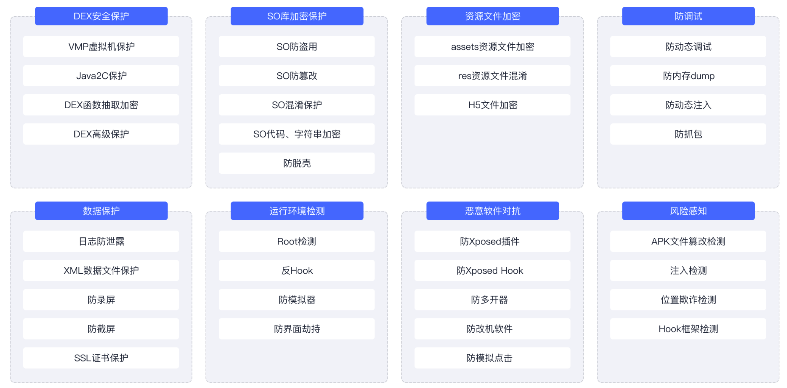  

我逆向过的国内主流企业加固方案有 梆梆加固，360加固，腾讯乐固，网易易盾，其他的主流加固方案还有爱加密，百度加固等，这些加固大部分都分试用版和企业版，其中梆梆加固的试用申请比较简单，所以我选择了梆梆加固。  
梆梆的加固方案主要是上文中提到的so层加固，可以看到应用的java层逻辑已经完全被抽离，真正的代码在`libSecShell.so`中动态解密还原，所以在java层面静态逆向是无法完成的。  
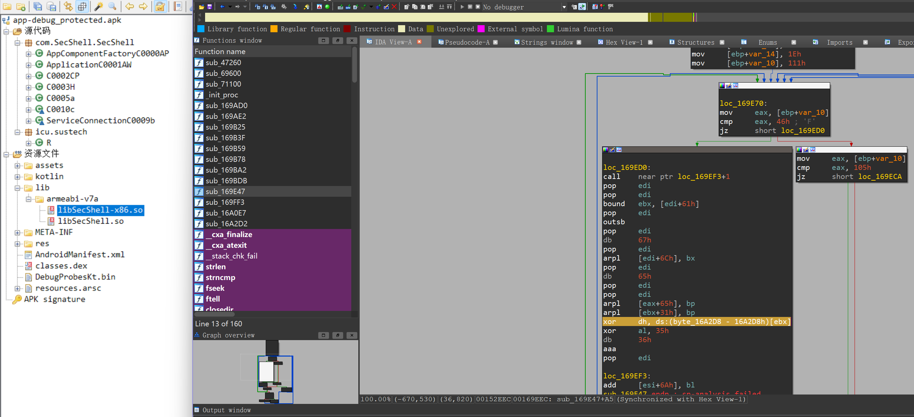

同时企业版的加固也会带自校验暗桩，即使APK成功打包签名也可能因为暗桩检测而无法运行。  

故使用现代企业的加固方案是无法简单通过java逆向重新打包APK的。

## Extra Credit

**以下内容仅出于学习目的研究，请勿传播**

我对武汉一家注册资本超过500万人民币的公司唯一主流产品进行了逆向工作，该软件的内容类似于在软件的监视下完成打卡任务。

逆向过程主要使用静态修补和动态调试。  
静态修补指在加壳的情况下修改`AndroidManifest.xml`文件中的程序入口和加载优先级，之后重打包并签名，绕过某些壳的部分保护。  
动态调试简单使用Xpost框架Hook掉`LoadClass`等常见动态解密后的加载入口点，使用FDex等Hook框架动态脱壳。
在今年8月后，该软件新增了相对高级的反Hook检测，因此对更高版本的逆向主要通过静态分析完成。  

该公司反逆向意识极强，从最早期的版本开始就使用了企业版的加固策略，以下是我对其历史版本中的三十余个版本脱壳逆向后总结出的该公司版本迭代的部分逆向相关的内容：

>3.5.0及之前  
壳主要为腾讯乐固，早期(1.0,2.X)使用过几次梆梆加固免费版  
最早期使用两对AES密钥，后添加第三对新AES密钥，主要使用该密钥  
盐也更换过一次  
新增的一对：K:`Wet2C8d34f62ndi3` IV:  `K6iv85jBD8jgf32D`  
第二代盐： `rDJiNB9j7vD2`  
3.5.1  
壳换为网易易盾  
3.5.2  
壳换为360加固第二代企业版  
之间的某个版本  
增加新的签名盐，现在两个(第2,3个)盐都有使用（第三个盐）  
新的盐： `7YyURuiqwb55D7Yk`  
3.6.2-今(3.6.6)  
启用新AES密钥（第四对）K:`goMEzJ1pDpncNHb9` IV:`ZUrAS2lUidjyY2gK`  
壳换为梆梆加固企业版  

以下是JNI获取上述对称密钥和盐进行加密和签名的函数（加解密在java层进行，so只用作获取加密的KEY和IV）：
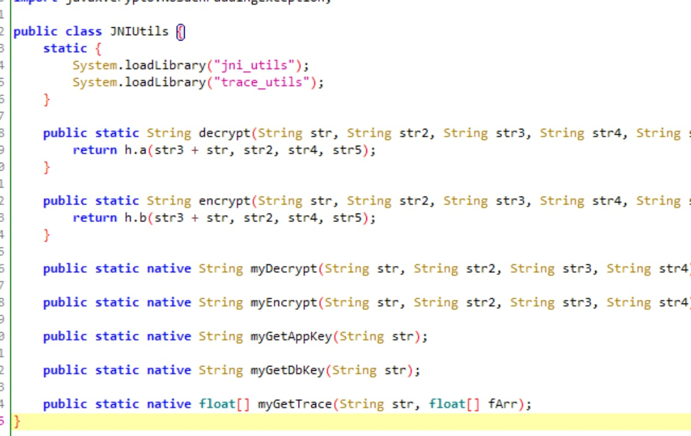  

包文构造逻辑：
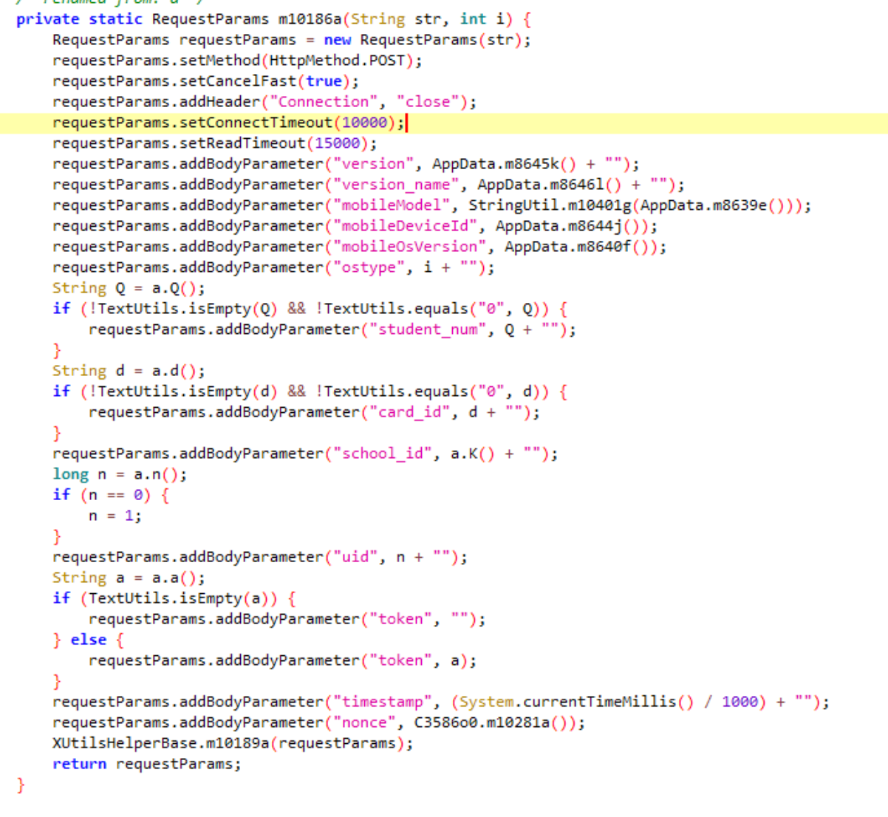  

签名部分相关逻辑：
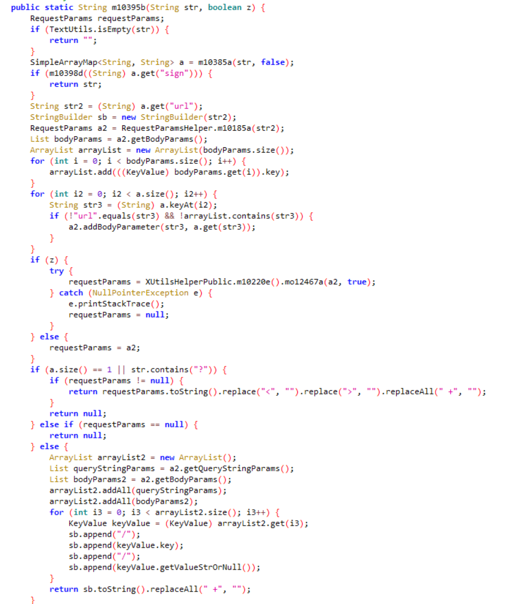  

伪造签名的POC:
```python
import hashlib
# 保护隐私隐去部分报文
data = {
    "token": "",
    "mobileDeviceId": "【mobileDeviceId】",
    "mobileModel": "【mobileModel】",
    "mobileOsVersion": "【mobileOsVersion】",
    "version": "7*",
    "version_name": "3.*.*",
    "ostype": "1",
    "school_id": "-1",
    "timestamp": "1665******",
    "nonce": "94******"
}
print(hashlib.md5((''.join([(i + data[i]) for i in sorted(data)]) + '盐的值').encode()).hexdigest())
```

加解密记录打卡任务的报文（报文的信息可以追溯到个人，故打码处理，但仍不完全脱敏）：
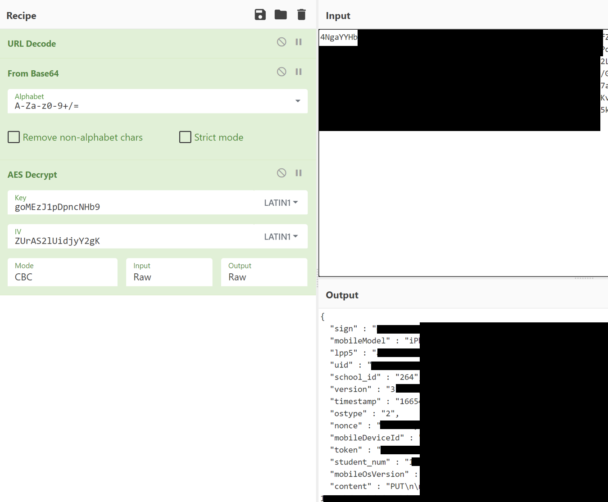  

总之，我提取出了其和服务器通信的报文格式，四组重要对称加密密钥，三组消息签名盐，可以构造打卡所需的密文和签名，绕过了软件的限制。

**其中重要密钥被提取是因为在今年10月最新版开发者使用企业版加固时候错误配置参数导致的，我认为可以算作安全漏洞提交至该公司。**

**以上内容仅出于学习目的研究，请勿传播**
