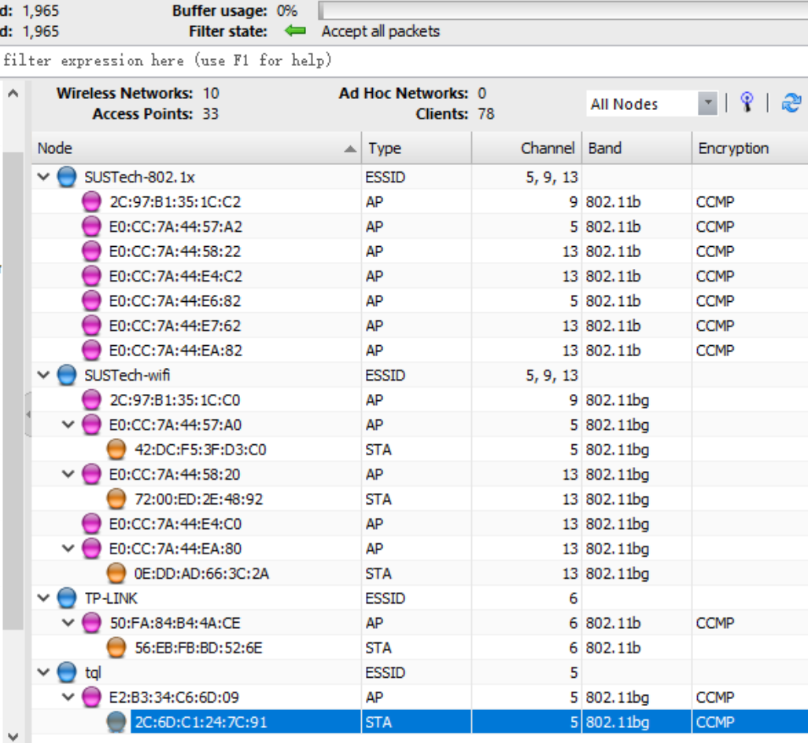
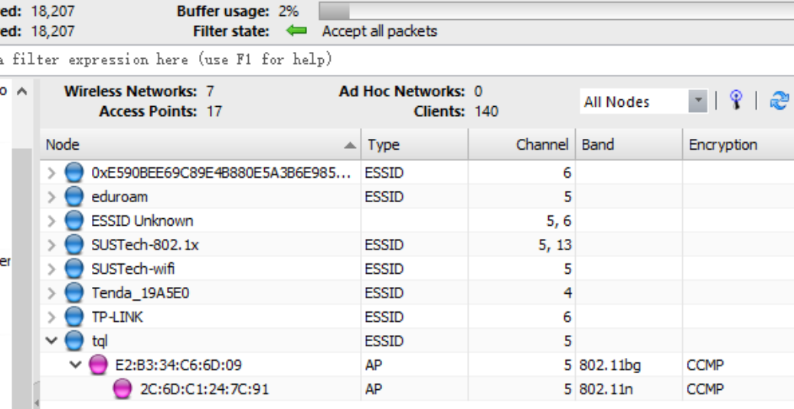
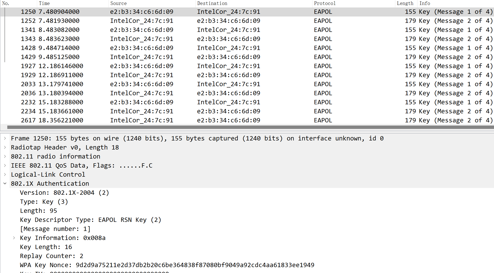
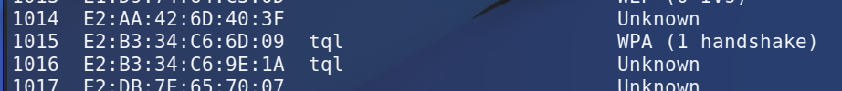
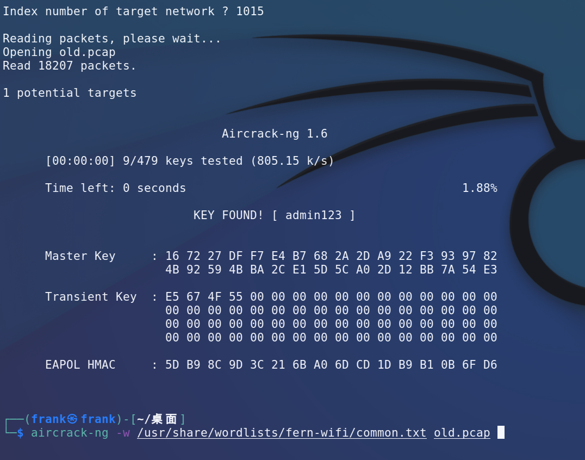
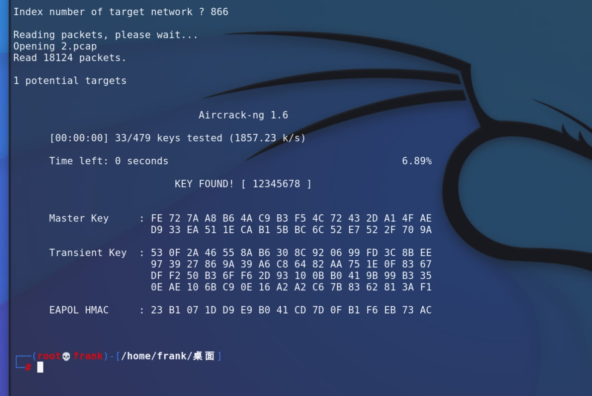
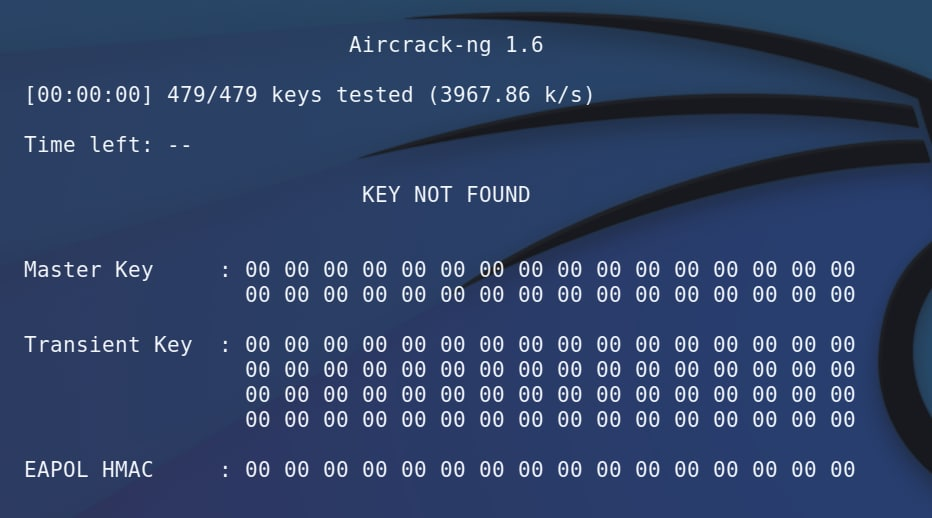
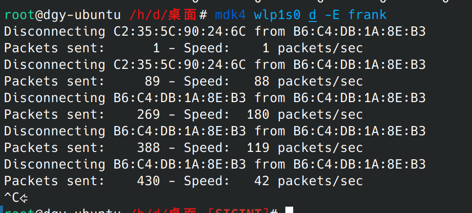
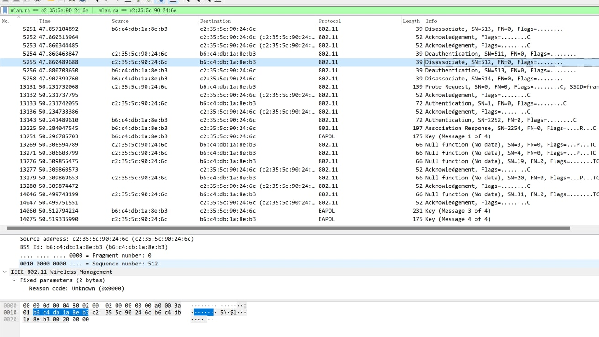

# part2
我使用windows系统完成本次lab，我购买了一块支持802.11x协议的无线网卡并直连到VM中，通过定制的驱动绕过windows对混杂模式的限制。  

首先将热点设置为弱密码以完成这一部分。  

首先使用Omnipeek扫描全802.11x频段：  
  

可见目标热点位于2.4G信号段，频道5。  
因为802.11x协议的RFC规定网卡同时只能在一个频道工作，所以上边的扫描模式会有严重的漏包，讲频道指定在5开始抓包，期间用其他设备链接一次热点：
  

将捕获的流量导出为pcapng，然后用电线鲨鱼打开，过滤eapol：  
  

可见抓到了完整的验证过程，接下来交给kali解决：

  

序号选之前图片中的mac设备，这里是1015，可见进行了一次WPA握手。
  
 

如果密码在字典中的话，非常快就可以拿到。

## 1. Read the lab instructions above and finish all the tasks.
请见上文正文
## 2. Answer the questions in the Introduction section, and justify your answers. Simple yes or no answer will not get any credits.
- a. What is the difference between Monitor Mode and Promiscuous Mode
  + 混杂模式是指捕获所有经过本机的数据流，而不区分目的地址是否属于自己，可以发生在有线和无线环境中。
  + 监视模式同样是指捕获所有可获取的数据流，但区别是流量不一定"经过"本机，可能只是空气中的无线流量被捕获。特指无线网卡。
  + 最明显的区别是，监视模式不需要和AP等接入点建立链接就可以捕获流量。
- b. What lessons we learned from this lab about setting the WiFi password?
   + 显然，不要使用过于简单的密码，如`12345678`，考虑使用强密码如 `sa7XCK1WSCXis4`
   + 同时，考虑使用更安全的握手方式。

## 3. Change your router to a different passphrase, and use the Wireshark and Aircrach-ng to crack the passphrase. Show screenshots of the result.
如同，改变密码为弱密码后仍可爆出密码：   
  
如图，改变强密码后不能爆出密码。    
  

## Extra Credit (3pt): Send a broadcast de-authentication packet to force clients to reconnect. Then you can capture the four-way handshake
作为卑微的Windows用户，我借用了同学的Debain主力系统完成这一部分，感谢 @ntdgy 同学的设备。  

设备链接到热点，攻击机通过`airmon-ng`切到监视器模式，通过课件中的`mdk4`对指定SSID的热点下的全部设备发送Deauth包：  
  

电线鲨鱼切到频道11可以抓到Deauth和重新链接的包：
  

上图可见抓到的deauth包和之后的重新链接请求。  