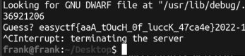

# 第六周wp

## liar
IDA F5一下玩一年，看一眼直接暴力：
```cpp
#include<iostream>
#include<ctype.h>
using namespace std;
long long f[37];

int __cdecl main(int argc, const char** argv, const char** envp){
    f[30] = '\xA0';
    f[10] = '/';
    f[13] = '\x04';
    f[25] = '\xCD';
    f[5] = 'W';
    f[24] = '\xF7';
    f[6] = 'L';
    f[31] = 176LL;
    f[7] = 74LL;
    f[34] = 154LL;
    f[21] = 231LL;
    f[32] = 135LL;
    f[8] = 75LL;
    f[1] = 102LL;
    f[9] = 75LL;
    f[28] = 232LL;
    f[29] = 148LL;
    f[3] = 108LL;
    f[11] = 33LL;
    f[4] = 127LL;
    f[14] = 21LL;
    f[18] = 89LL;
    f[16] = 3LL;
    f[26] = 215LL;
    f[20] = 211LL;
    f[15] = 8LL;
    f[17] = 25LL;
    f[27] = 217LL;
    f[0] = 101LL;
    f[33] = 143LL;
    f[22] = 245LL;
    f[19] = 241LL;
    f[12] = 56LL;
    f[36] = 129LL;
    f[23] = 206LL;
    f[2] = 125LL;
    f[35] = 202LL;
    for (int n = -2147483648; n < INT32_MAX; n++) {
        int m; // [rsp+14h] [rbp-Ch]
        char g[38];
        m = n ^ 0x58EB29;
        for (int i = 0; i <= 36; ++i)
            g[i] = (m * i) ^ f[i];
        g[37] = 0;
        if (g[0] == 101 && g[1] == 97 && g[2] == 115 && g[3] == 121 && g[4] == 99 && g[5] == 116 && g[6] == 102) {
            printf("the flag is %s\n", g);
        }
    }
    return 0;
}

```

## ezreverse

口算解方程，但我小学数学不太好，所以丢给Z3保证算对：
```python
from z3 import *

v8 = z3.BitVecs('v0 v1 v2 v3 v4', 8)

s = z3.Solver()

s.add(v8[1] + 2 == 0x35)
s.add(v8[2] + 3 == 0x7d)
s.add(v8[3] + 4 == 0x6f)
s.add(v8[4] + 5 == v8[3] + 4 + 3)
s.add(v8[0] + 1 == v8[4] + 5 - 10)
s.check()
model = s.model()
print(model)
print(chr(103) + chr(51) + chr(122) + chr(107) + chr(109))
```

## LuckyGuess
只需要猜一次，那就动态一下  
  
