# 钉枪攻击
`注①：因Arm手册频繁更新，文中"官方手册"均指Arm_Reference_Manual_DDI0487G_b_armv8_arm`  
`注②：报告中没有给出完全的手册截图，但一定会给出详细的页码。`


对于Armv8的ExceptionLevel(EL)来说，引用课件中的图例，我们平时的应用和内核都在左上角的ELO和EL1运行，而其对橙色区域TEE权限隔离的支持是通过硬件在EL3实现的。  
通过张教授和宁教授提出的钉枪攻击，我们可以通过EL0和EL1从EL1提权到EL3，以EL3特权执行任意代码，显著的用途是从不可信的EL1打破外部世界和TEE的隔离。  
（这里省略对TEE的介绍）  
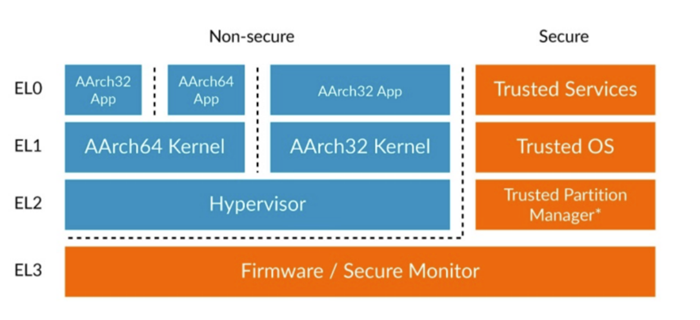   

碎碎念：  
如果kernel吐了异常出来，不管是panic还是Oops，一律poweroff重启，避免踩到硬件黑盒(或者近乎黑盒)状态机的坑。 

推荐参考深圳纽创信安的两篇讲的非常详细的博客  
http://aosptataca11www.opsefy.com/technical-information-show-77.html  
http://aosptataca11www.opsefy.com/technical-information-show-78.html  

## Task 1: Create and Install a Kernel Module
由上文介绍，我们首先需要编写内核模块从EL0进入EL1，这一步是大多数*inx kernel给出的支持，在root权限下可以通过加载内核模块的方法从EL0进入EL1，我们仍在外部世界，这一步的权限是假定拥有的。  
根据课件要求编译课件中的代码并加载+卸载内核模块：  
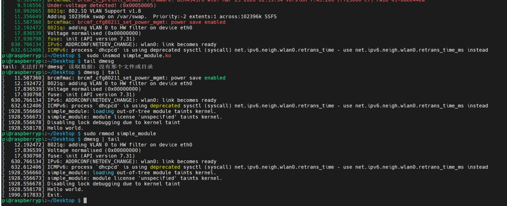  

## Task 2: Directly Access a High Privilege Register: SCR
根据Armv8官方手册，SCR只能在EL3特权下访问，因此被作为钉枪POC的例子，只要我们可以通过执行代码读取SCR，我们就能证明我们可以以EL3特权运行任意代码。 

关于SCR，手册6809页截图如下：
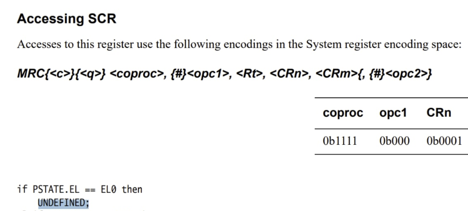  
 
### Task 2.a: What is the complete instruction? Look up the manual and fill the instruction bellow. Then compile and execute.
根据6809页对SCR的定义，用以下代码直接读取SCR：  
```c
__asm__ __volatile__("mrc p15, 0, %0, c1, c1, 0":"=r"(reg));
```

### Task 2.b: Question: Why the segmentation fault occurs?

运行后报未定义指令并段错误，因为dmesg更全这里就不放运行截图了，直接贴dmesg的输出：   
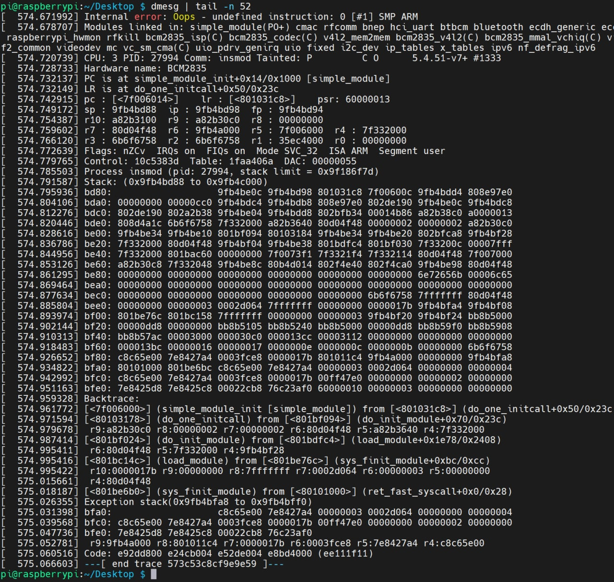   
可见内核抱怨（**Oops**）了一下，并告诉我们执行了未定义指令。  
同样根据6809页的伪代码可以看出，只有在EL3下会return SCR，其余不是trap就是UNDEFINED。

所以我们收到内核抱怨未定义是因为访问SCR时特权级别不够。

## Task 3: Read the Debug Authentication Signal
根据钉枪论文的描述，似乎四种调试信号都开启才保证易受到钉枪攻击。  
DBGAUTHSTATUS的定义在手册6947页中截图如下：  
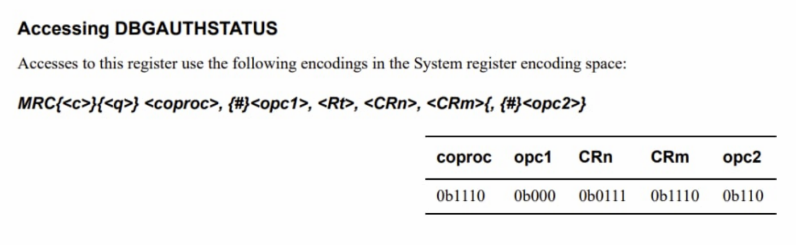  

### Task 3.a: Question: What is the instruction to read DBGAUTHSTATUS? Suppose we want to store it in Rt.
根据6947页对DBGAUTHSTATUS的定义，用以下代码读取DBGAUTHSTATUS：  
```c
__asm__ __volatile__("mrc p14, 0, %0, c7, c14, 6":"=r"(reg));
```

### Task 3.b: Take single_module.c as an example, write your kernel module to read the signal. A screenshot of the result is needed, and tell us what is the meaning of the result. What kind of debug events are enabled?
执行结果如下，读到的值是`0xff`：
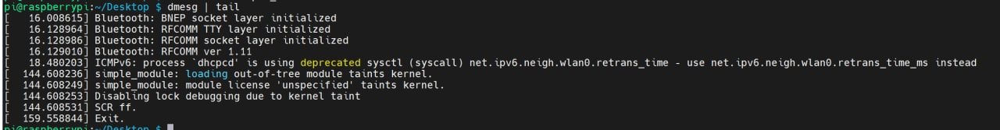   
根据6947页及之前以及钉枪论文中的定义：  
>ARM为外部调试认证定义了四个信号，即DBGEN、NIDEN、SPIDEN和SPNIDEN。
>DBGEN信号控制系统中是否允许非安全侵入式调试。
>当信号DBGEN或NIDEN为高电平时，将启用非安全非侵入性调试。
>同样，SPIDEN信号和SPNIDEN信号分别用于控制安全侵入式调试和安全非侵入式调试

上述的四个调试信号在手册6946页的图中可见对应读到数值的低8位：
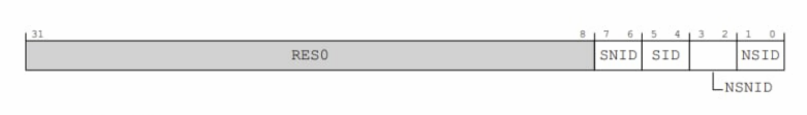  

手册图太大了就不贴了，版本和页码都有了，总之低8位全为1意味着四个调试信号都处于高电平，非安全非侵入性调试 安全侵入式调试和安全非侵入式调试都是允许的。

## Task 4: Enable the Halting Debug
放个疑问在这（题目没问！别扣分！）：
- 为什么要解锁两组不同基地址寄存组器里的相同寄存器？  

EDLAR的偏移可以在手册7551页找到：  
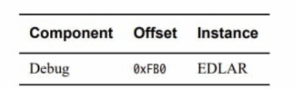  

OSLAR的偏移可以在手册7597页找到，另外本页的之后会用到：
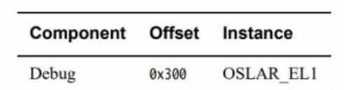  

在上述手册页中也给出了解锁的方法，分别是置`0xc5acce55`和置`0`，代码如下：   
```c
	iowrite32(0xC5ACCE55, param->debug_register + EDLAR_OFFSET);
	iowrite32(0xC5ACCE55, param->cti_register + EDLAR_OFFSET);
	iowrite32(0, param->debug_register + OSLAR_OFFSET);
	iowrite32(0, param->cti_register + OSLAR_OFFSET);
```
有趣的是，密码`0xc5acce55`是`CS ACCESS`的LeetCode。


## Task 5: Switch to the EL3 and read the SCR

### Task 5.a: We mention how to access SCR directly in Task 2. You need to prepare an instruction, who reads SCR and store it to R1. Then convert it to machine code (do it on yourself) and execute it on the target.

### Task 5.b: After you finish Task 5.a, you need to transfer the value in R1 on core 0, to the local variable scr. It will be printed later. DBGDTRTXint and DBGDTRTX would be helpful in your implementation

这两步合并，使用一开始direct access的汇编读取SCR，用上边读reg的代码转存读到的值  

我使用godblot交叉编译：
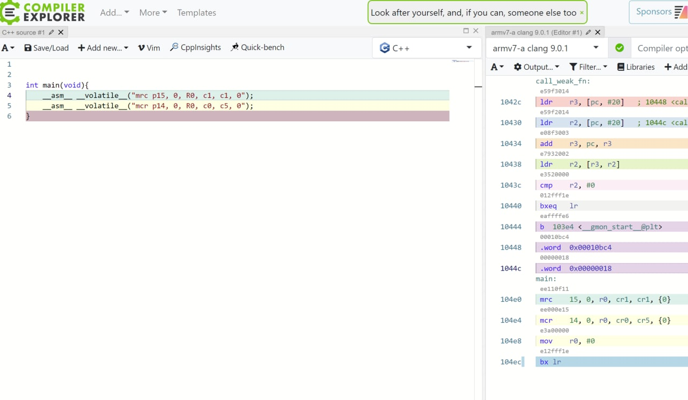  
这里叉编踩了坑，钉枪论文中有说v7和v8的汇编需要2字节反序一下...:
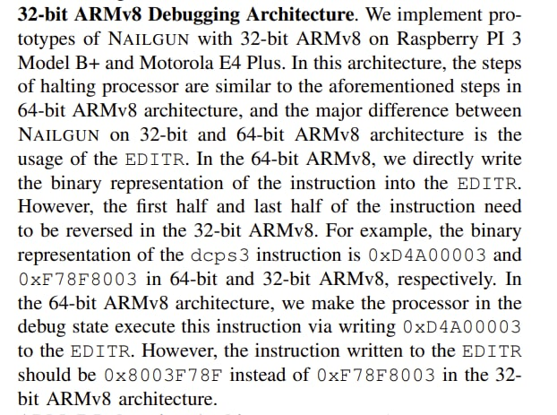  

用上述叉编得到的机器码完成SCR的读取和转存：
```c
	printk(KERN_INFO "Step 7: Read SCR\n");
  // 0xee110f11 <=> mrc p15, 0, R0, c1, c1, 0
	execute_ins_via_itr(param->debug_register, 0x0f11ee11);
	// 0xee000e15 <=> mcr p14, 0, R0, c0, c5, 0
	execute_ins_via_itr(param->debug_register, 0x0e15ee00);
	scr = ioread32(param->debug_register + DBGDTRTX_OFFSET);
```

## Task 6: Restore the Context and Exit

读取到的SCR:
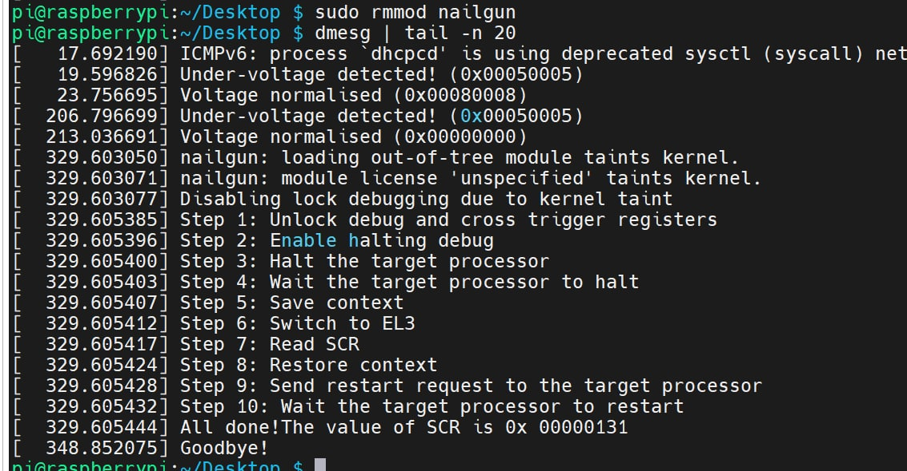  

SCR的值在手册6805到6809页中定义：
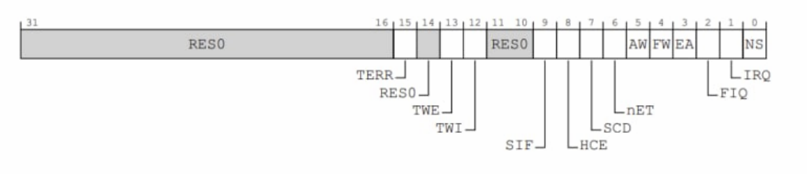  

`0x131=0b100110001`，也就是第0 4 5 8 位为1，对应`NS FW AW HCE`开启。  
给出了手册的页码我就不再把手册内容复制/截图一遍了。  

总之我们成功读取了SCR的值，因此可以证明钉枪在该设备上可以EL3特权运行任意代码。  

## Submission Task
### 1. During this lab, what is the base address of Cross Trigger Interface in Raspberry Pi 3? Can your find the global address of CTICONTROL register in Raspberry Pi 3 according to the Arm Reference Manual? Answer the address value and show your calculation. (hint: Find the offset)
Cross Trigger Interface在树莓派三的基址在lab课件中的代码已经给出：
```c
// 0x40038000 is the base address of the cross trigger interface registers on Core 0
#define CTI_REGISTER_ADDR 0x40038000
```

有趣的是，据说对于基址不公开的硬件厂商，只能通过长度0x1000的内存映射遍历寻找，特征为对指定偏移为特定值，有些寄存器值不为0且几乎是固定的。  

根据ARMv8手册第7479页，CTI中的CTICONTROL寄存器的偏移是0x0
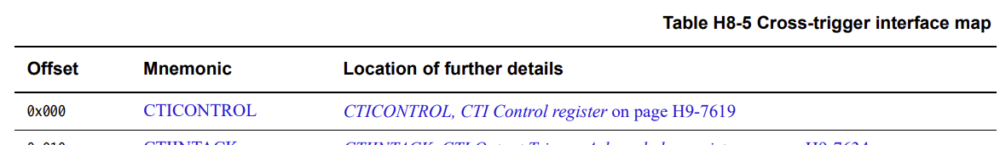  

CTICONTROL寄存器的全局地址=`base_addr + offset = 0x40038000 + 0x0 = 0x40038000`

### 2. Do we have another way to unlock the OS Lock in this lab except memory mapping? If yes, how to do that? Justify your answer.
首先，答案是有的，参考手册7597页：
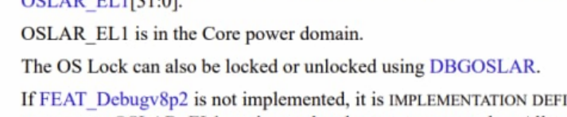  

也就是说，除了通过内存映射修改目标核寄存器，我们还可以直接在`Core 0`上运行代码修改`DBGOSLAR`的值来解锁OS Lock。  

但钉枪本身只需要Core 1的执行权限，这种方法还需要有权限访问Core 0，可能新增了限制。  

下面证明该方案可行，注意代码运行需要在`Core 0`上完成，不指定运行核是不能完成钉枪攻击的。  

首先，我将`read_scr`拆分成三部分，第一部分用于解锁EDLAR并锁定OSLAR：
```c
    printk(KERN_INFO "Step 1: Unlock cross trigger registers\n");
	iowrite32(0xC5ACCE55, param->debug_register + EDLAR_OFFSET);
	iowrite32(0xC5ACCE55, param->cti_register + EDLAR_OFFSET);
	printk(KERN_INFO "[Frank] Step 1+: Lock OS registers\n");
	iowrite32(0xC5ACCE55, param->debug_register + OSLAR_OFFSET);
	iowrite32(0xC5ACCE55, param->cti_register + OSLAR_OFFSET);
```
根据手册定义，上述操作后OS会被Lock。  
然后通过在core 0直接执行代码解锁lock：
```c
static void unlock_debug(void* _) {
	// Unlock self debug registers
	printk(KERN_INFO "[Frank] Step 1+: Unlock debug registers not using MAP\n");
	uint32_t reg = 0;
	__asm__ __volatile__("mcr p14, 0, %0, c1, c0, 4":"=r"(reg));
}
```
接下来继续执行正常的部分，在主函数中的逻辑是：  
```c
	// 锁定OSLAR，解锁EDLAR
    smp_call_function_single(1, read_scr_first, param, 1);

    // 不通过内存映射解锁OS lOCK
    smp_call_function_single(0, unlock_debug, param, 1);
 
    // 继续执行钉枪的剩余部分
	smp_call_function_single(1, read_scr, param, 1);
```

我编译了`nailgun-lock.ko`，**注释掉了在Core 0解锁的部分**，来证明锁定后Core 0解锁是必须的。  
另外编译了`nailgun.ko`，通过上述代码不用内存映射解锁。

可见反复加载运行`nailgun-lock.ko`，SCR都没有成功读取，0为变量声明时的初始值。  
加载运行 `nailgun.ko`，通过在Core 0上直接执行解锁代码成功获取到了SCR的值，没有通过映射内存对应的寄存器解锁。  

情况和解释如下图：
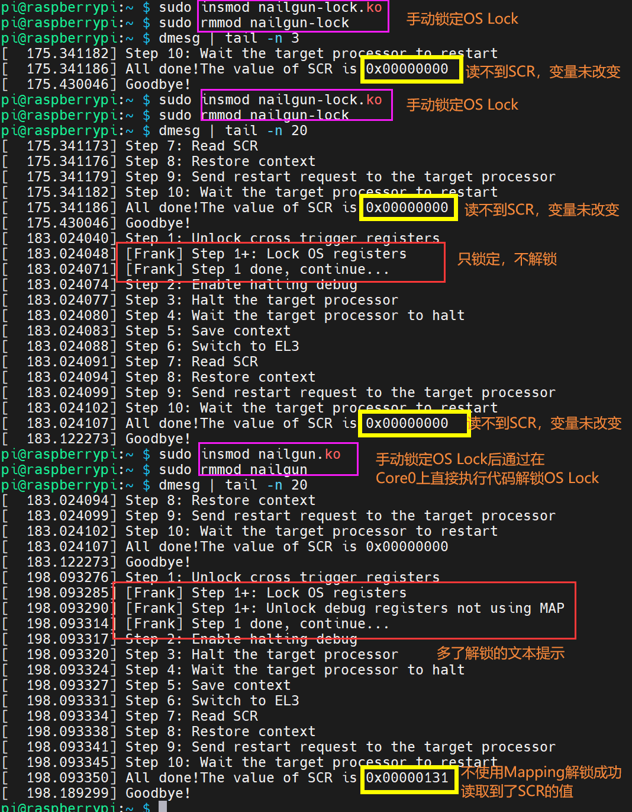  

