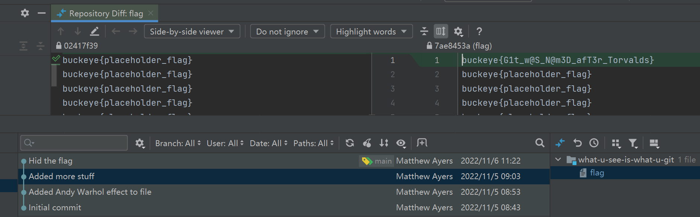
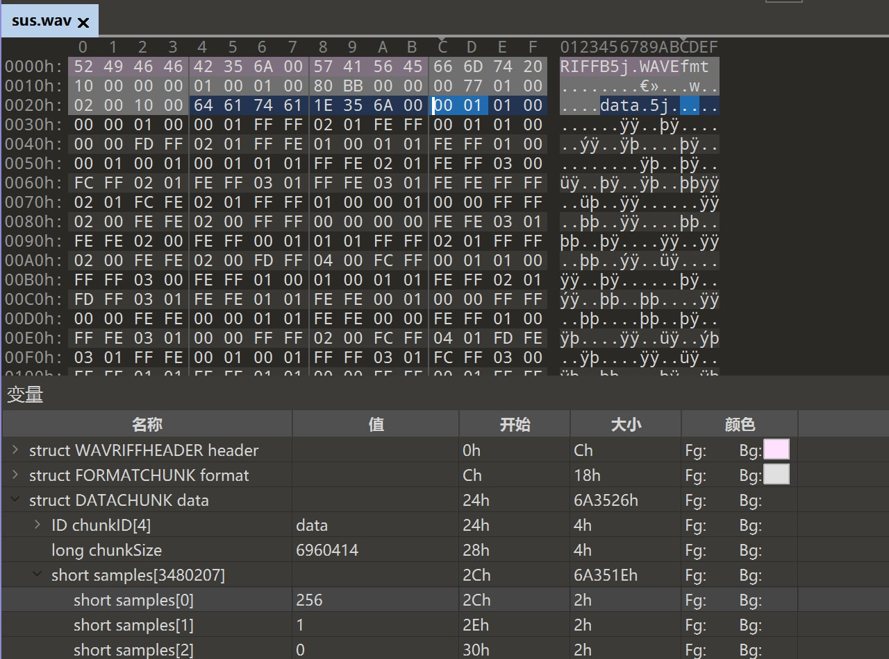

# 第七周

## what-u-see-is-what-u-git
貌似是删了没gc，可以revert..但是JB一把梭（JB对git的支持太强大了！）
  

## sus
是lb，不是WAV的lsb。   
如图每个sample是两byte，然后常见LSB脚本就会每两byte取一个lsb  
  

但这题提示音频炸的很明显，所以除了lsb还有别的位被动了(第8位)，取每个byte的lb(lb不是lsb)就出了

```python
s = open("sus.wav", "rb").read()
r = ""
for i in range(0x2c, len(s), 1):
    r += str(s[i]&1)

print(bytes([int(r[i:i+8], 2) for i in range(0, len(r), 8)]))
```

## keyboardwarrior

过滤中间那一段非常整齐的人机输入设备包`btatt.handle == 0x001d`

导出为json。按 https://gist.github.com/MightyPork/6da26e382a7ad91b5496ee55fdc73db2 给出的扫描值复现，直接提交不对，把数字的shift忽略就可以了  

```python
import json

r = json.load(open("1.json", "r", encoding="utf-8"))
s = ""
shift = False
for i in r:
    j = i['_source']['layers']['btatt']['btatt.value']
    if j[6:8] != "00":
        v = int(j[6:8], 16)
        if 0x4 <= v <= 0x1d:
            if shift:
                s += chr(v + 0x41 - 0x4)
            else:
                s += chr(v + 0x61 - 0x4)
        elif v == 0x2d:
            if shift:
                s += "_"
            else:
                s += "-"
        elif v == 0x2f:
            s += "{"
        elif v == 0x30:
            s += "}"
        elif 0x1e <= v <= 0x27:
            #if shift:
            #    s += "!@#$%^&*()"[v - 0x1e]
            #else:
                s += "1234567890"[v - 0x1e]
        else:
            print(v)
        shift = False
    elif j[:2] == "02":
        shift = True

print(s)
```