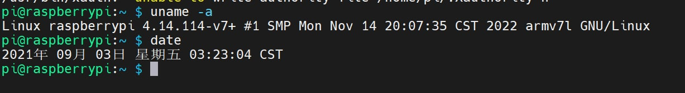
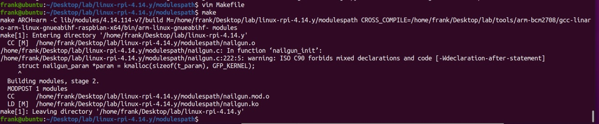
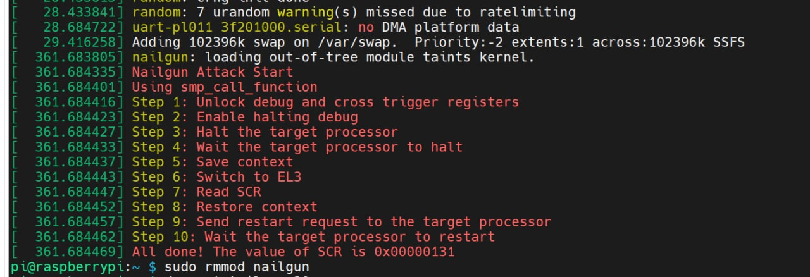
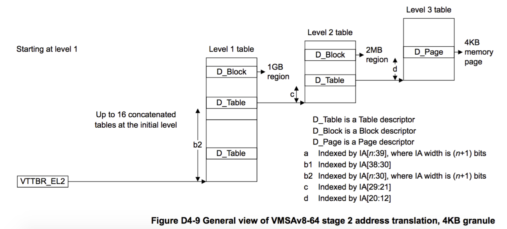
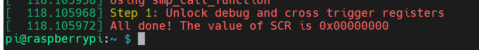
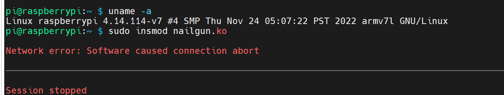
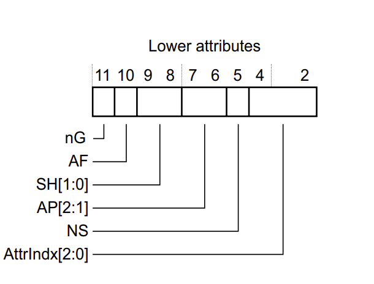
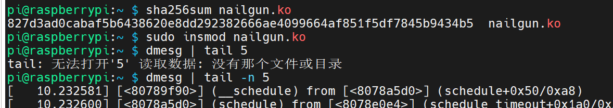
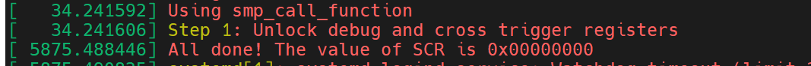
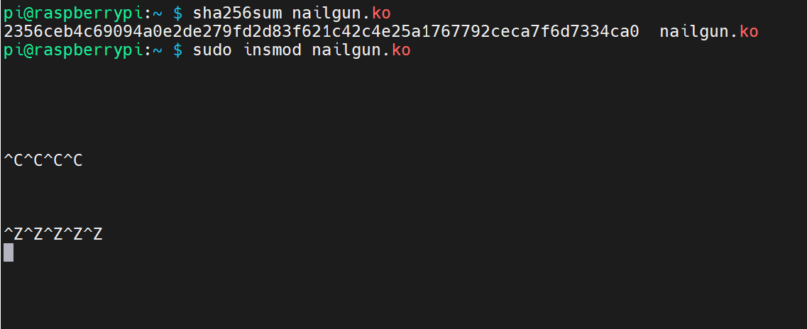

# 钉枪防御
`注①：出于隐私考虑，我的学号用11451419代替（不存在的唯一学号）`  

### Question 1:(20%) Can you prove that (1) you have replaced the kernel (with ”uname -r” or other approaches), and (2) you have built the nailgun module with new headers? Please provide a figure.
使用给出的附件，按要求编译：
```bash
sudo apt install vim g++ make libncurses-dev flex bison

make -j8 ARCH=arm CROSS_COMPILE=../tools/arm-bcm2708/gcc-linaro-arm-linux-gnueabihf-raspbian-x64/bin/arm-linux-gnueabihf- bcm2709_defconfig
make -j8 ARCH=arm CROSS_COMPILE=../tools/arm-bcm2708/gcc-linaro-arm-linux-gnueabihf-raspbian-x64/bin/arm-linux-gnueabihf- menuconfig
# [PRESS ESC]

rm -rf ../modulespath
mkdir ../modulespath
make clean
make -j8 ARCH=arm CROSS_COMPILE=../tools/arm-bcm2708/gcc-linaro-arm-linux-gnueabihf-raspbian-x64/bin/arm-linux-gnueabihf- zImage dtbs modules
make -j8 ARCH=arm CROSS_COMPILE=../tools/arm-bcm2708/gcc-linaro-arm-linux-gnueabihf-raspbian-x64/bin/arm-linux-gnueabihf- modules_install INSTALL_MOD_PATH=../modulespath

export BOOTDIR='[YOUR MEDIA PATH, e.g. /media/frank]'
./scripts/mkknlimg ./arch/arm/boot/zImage $BOOTDIR/boot/kernel7.img
cp $BOOTDIR/kernel7.img $BOOTDIR/boot/kernel.img
cp ./arch/arm/boot/dts/bcm2710-rpi-3-b-plus.dtb $BOOTDIR/boot/
cp ./arch/arm/boot/dts/overlays/*.dtb* $BOOTDIR/overlays/
```
之后启动树莓派（这张是第一次的截图，之后都是v7了，奇妙）：  
  
可以看到切到了指定的内核版本。  

然后叉编钉枪的模块：  
  

可见使用新的头文件顺利编译了钉枪。  

### Question 2:(20%) Can you run the Nailgun Attack on your new kernel? Please provide a figure. You can use ”dmesg” to show the execution result of Nailgun Attack.
将新叉编的钉枪模块传入替换了内核的树莓派中，可以正常执行：  
  


### Question 3:(30%) With the provided source codes, can you explain the process of traslating an IPA, 0x40030000+”last 3 numbers of your student ID”, to the same value of PA? (e.g., if your ID is 12150073, then you should translate 0x40030073). In this question, you should mention the (1) address of each descriptor, and (2) value of each descriptor. 

翻译过程可以参考instruction的Figure 13或者  
https://armv8-ref.codingbelief.com/zh/chapter_d4/d42_5_overview_of_the_vmsav8-64_address_translation.html 中的描述(n=5)：
  
**请注意，这里我的学号以不会和其他人重复的随机数 `11451419` 替代**  
**以下代码如运行在非32位环境下请手动 & 0xFFFFFFFF**。

- 首先，要翻译的地址(IPA)是 `0x40030419`
- 在DEMO中，VTTBR的地址是 `0x32000000`
- 根据IPA和VTTBR，由要求文档的Figure 13可以计算出Descriptor Address(下称DA1)的地址：  
  + DA1 = ( VTTBR >> 5 << 5 ) | ( IPA >> 30 << 3 )
  + DA1 = ( 0x32000000 >> 5 << 5 ) | ( 0x40030419 >> 30 << 3 )
  + DA1 = 0x32000008
- 0x32000008的值为 `0x32010003` ，低2位是 `0b11` ，说明这是一个Level 1 Table Descriptor(下称L1TB)，继续翻译
- 根据IPA和L1TB，由要求文档的Figure 13来计算此时Descriptor Address(下称DA2)的地址：
  + DA2 = ( L1TB >> 12 << 12 ) | ( IPA << 2 >> 23 << 3 )
  + DA2 = ( 0x32010003 >> 12 << 12 ) | ( 0x40030419 << 2 >> 23 << 3 )
  + DA2 = 0x32010000
- **注意 0x32010000 的值被手动修改开启了三级翻译**。  
- 0x32010000 的值为 `0x32020003`，低2位是 `0b11` ，说明这是一个Level 2 Table Descriptor(下称L2TB)，继续翻译
- 根据IPA和L2TB，由要求文档的Figure 13来计算此时Descriptor Address(下称DA)的地址：
  + DA3 = ( L2TB >> 12 << 12 ) | ( IPA << 11 >> 23 << 3 )
  + DA3 = ( 0x32020003 >> 12 << 12 ) | ( 0x40030419 << 11 >> 23 << 3 )
  + DA3 = 0x32020180
- **注意 0x32020180 的值被手动修改设为了0**。 
- 0x32020180 的值为 `0x0`，翻译结束，返回 PA = `0`


### Question 4:(30%) With the provided source codes, can you explain the process of traslating an IPA, 0x40000000+”last 7 numbers of your student ID”, to the same value of PA? (e.g., if your ID is 12150073, then you should translate 0x42150073). In this question, you should mention the (1) address of each descriptor, and (2) value of each descriptor. 

- 同上，要翻译的地址(IPA)是 `0x41451419`
- 类似上文，计算DA1的地址：  
  + DA1 = ( VTTBR >> 5 << 5 ) | ( IPA >> 30 << 3 )
  + DA1 = ( 0x32000000 >> 5 << 5 ) | ( 0x41451419 >> 30 << 3 )
  + DA1 = 0x32000008
- 0x32000008的值为 `0x32010003` ，继续翻译
- 类似上文，计算DA2的地址：
  + DA2 = ( L1TB >> 12 << 12 ) | ( IPA << 2 >> 23 << 3 )
  + DA2 = ( 0x32010003 >> 12 << 12 ) | ( 0x41451419 << 2 >> 23 << 3 )
  + DA2 = 0x32010050。  
- 0x32010050 的值为 `0x00400000414004c9`，低2位是 `0b01` ，说明这是一个Block Descriptor，不继续翻译
- 以DA2的[31:20]为PA的[31:20]，以IPA的[19:0]为PA的[19:0]，返回 PA = `0x41451419`

### Question 5:(20% Bonus) If we have reserved a 4KB memory space (0xa000_0000 0xa000_0fff), and we want to forbid EL1&0 to access it, what can we do? You need to (1) submit the ”head.S” file, and (2)explain how the Stage-2 translation work on your translation table. For example, you can use an IPA 0xa0000120, and explain how the access failed.
先写一下对 `head.S` 里新增配置页表汇编的解读：  
```asm
// 钉枪寄存器的范围是 0x40030000 - 0x40031000
//                和 0x40038000 - 0x40039000 （这个不保护）
// 我们创建页表用的是 0x32000000 - 0x32200000

// 首先，使用课件中的代码保存寄存器的旧值
	ldr r0,=0x32000100
	str r2,[r0]
	ldr r0,=0x32000104
	str r3,[r0]
	ldr r0,=0x32000108
	str r4,[r0]
	ldr r0,=0x3200010C
	str r5,[r0]
	ldr r0,=0x32000110
	str r1,[r0]

//  接下来修改二级页表
//for lv2 0x4-0x8
	ldr r3,=0x00400000
	ldr r0,=0x32010000
	ldr r1,=0x000004C9
	ldr r2,=0x400
	ldr r4,=0x800
5:
	mov r5,r2
	lsl r5,#20         // 向 0x32010000 - 0x32010800 写入
	orr r5,r5,r1       //   0x4**004C9 - 0x8**004C9
	str r5,[r0]
	add r0,r0,#4
	str r3,[r0]
	add r0,r0,#4  
	add r2,r2,#2       // 512个 每个2MB
	cmp r2,r4
	bne 5b
	
	//the special table
	ldr r0,=0x32010000
	ldr r1,=0x32020003  
	str r1,[r0]        // *0x32010000 = 0x32020003
	add r0,r0,#4       // 先前是 0x400004C9 （2mb的二级页表）
	ldr r1,=0x0        // 将 0x40000000 ~ 0x401fffff 的映射设置为继续翻译
	str r1,[r0] 	   // *0x32010004 = 0x0
	
//  接下来修改三级页表
	//for lv3
	ldr r3,=0x00400000
	ldr r0,=0x32020000
	ldr r1,=0x400004CB
	ldr r2,=0x0
	ldr r4,=0x200
6:
	mov r5,r2
	lsl r5,#12          // 向 0x32020000 - 0x32020800 写入
	orr r5,r5,r1        //   0x40***4CB - 0x402004CB
	str r5,[r0]
	add r0,r0,#4
	str r3,[r0]
	add r0,r0,#4
	add r2,r2,#1        // 512个 每个4kb
	cmp r2,r4
	bne 6b
	
	//cannot access
	ldr r0,=0x32020180  // *0x32020180 = 0
	ldr r1,=0x0         // 原先是 0x400304CB （4kb的三级页表）
	str r1,[r0]         // 保护调试寄存器
	add r0,r0,#4
	str r1,[r0]
	

	//for lv2 0x0-0x4
	ldr r3,=0x00000000
	ldr r0,=0x32030000
	ldr r1,=0x000007FD
	ldr r2,=0x0
	ldr r4,=0x400
7:
	mov r5,r2
	lsl r5,#20          // 向0x32030000-0x32030400 写入
	orr r5,r5,r1        //   0x0**007FD - 0x400007FD
	str r5,[r0]         // 这里的粒度是 2mb 不需要继续翻译
	add r0,r0,#4
	str r3,[r0]
	add r0,r0,#4
	add r2,r2,#2        // 512个 每个2MB
	cmp r2,r4
	bne 7b
	//remove it
	ldr r0,=0x32030c80  // 向 0x32030c80 写入0
	ldr r1,=0x0         // 原先是 0x320007FD （2mb的二级页表）
	str r1,[r0]         // 保护我们的页表
	add r0,r0,#4
	str r1,[r0]
	
	//start
	ldr r0,=0x32000000
	// -----------block 1-------
	ldr r1,=0x32030003  // 第一个一级页表，1GB，3的后两位是11，说明是Table，去 0x32000000 找
	str r1,[r0]         // *0x32000000 = 0x32030003
	add r0,	r0,	#4      // 翻译这个保护我们的页表
	ldr r1,=0x0
	str r1,[r0]         // *0x32000004 = 0
	add r0, r0, #4      
	// -----------block 2-------
	ldr r1,=0x32010003  // 第二个一级页表，1GB，去 0x32000000 找
	str r1,[r0]         // *0x32000008 = 0x32010003
	add r0,	r0,	#4      // 翻译这个保护调试寄存器
	ldr r1,=0x00000000
	str r1,[r0]         // *0x3200000C = 0
	add r0, r0, #4      
	// -----------block 3-------
	ldr r1,=0x800004C9  // 第三个1GB，9的后两位是01，说明是Block，不继续翻译
	str r1,[r0]         // *0x32000010 = 0x800004C9
	add r0,	r0,	#4
	ldr r1,=0x00400000
	str r1,[r0]         // *0x32000014 = 0x00400000
	add r0, r0, #4     
	// -----------block 4-------
	ldr r1,=0xC00004C9  // 第四个1GB，不继续翻译
	str r1,[r0]         // *0x32000018 = 0xC00004C9
	add r0,	r0,	#4
	ldr r1,=0x00400000  
	str r1,[r0]         // *0x3200001C = 0x00400000
	add r0, r0, #4      
	// ---------others abort-------
	ldr r1,=0x0        // 不管其他的，32 位系统的寻址空间是 4GB 所以不影响
	str r1,[r0]        // *0x32000020 = 0
	add r0,	r0,	#4
	ldr r1,=0x0
	str r1,[r0]        // *0x32000024 = 0
	add r0, r0, #4
	ldr r1,=0x0        // *0x32000028 = 0
	str r1,[r0]
	add r0,	r0,	#4
	ldr r1,=0x0
	str r1,[r0]        // *0x3200002C = 0
	add r0, r0, #4
	//---------fill vtcr-------
	ldr r1,=0x80000040
	mcr p15, 4, r1, c2, c1, 2
	isb 
	//--------fill vttbr--------
	ldr r0,=0x32000000
	ldr r1,=0x0
	mcrr p15, 6, r0, r1, c2
	isb
	//give back
	ldr r0,=0x32000100
	ldr r2,[r0]
	ldr r0,=0x32000104
	ldr r3,[r0]
	ldr r0,=0x32000108
	ldr r4,[r0]
	ldr r0,=0x3200010C
	ldr r5,[r0]
	ldr r0,=0x32000110
	ldr r1,[r0]
	//------turn on---------
	mrc p15, 4, r0, C1, C1, 0 
	orr	r0, r0, #0x1
	mcr p15, 4, r0, C1, C1, 0
	isb
	mov r0,#0
```

使用修改过的 `head.S` 编译内核，加载钉枪模块  
（删去了后边部分，只保留了对 0x40030000 处调试寄存器组的写入）  

将寄存器的地址改为未保护的地址，可以正常运行：
```c
#define DEBUG_REGISTER_ADDR             0x40038000
```
  

将寄存器的地址改为还原
```c
#define DEBUG_REGISTER_ADDR             0x40030000
```
可见内核进入了无休止的卡死：  
  

**说明修改过的内核确实保护了 0x40030000 ~ 0x40030fff 的4kb空间**。

如果我们要保护0xa000_0000开始的4KB的空间，可以参考保护调试寄存器的做法。  

关于Block的低位低12-2位的描述，手册6293页有：
  

保留之前三级页表的低位即可。 

我们需要对提供的 `head.S` 做以下修改：  
- 修改第三个1gb（0x8000_0000-0xbfff_ffff)的一级页表为Table Descriptor，指向一个新的二级页表
  ```asm
	// -----------block 3-------
	ldr r1,=0x32040003  // 为了阻止 0xa0000000 - 0xa000_0fff 的访问，将这部分设为Table
	str r1,[r0]         // *0x32000010 = 0x32040003
	add r0,	r0,	#4
	ldr r1,=0
	str r1,[r0]         // *0x32000014 = 0
	add r0, r0, #4     
  ```
- 将二级页表分为512个2mb的Block Descriptor，然后手动修改第257个Block Descriptor为Table Descriptor，指向一个新的三级页表。257对应位为0xa00
  ```asm
    // 二级页表
	ldr r3,=0x00800000
	ldr r0,=0x32040000
	ldr r1,=0x000004C9
	ldr r2,=0x800
	ldr r4,=0xc00
	8:
	mov r5,r2
	lsl r5,#20         // 向 0x32040000 - 0x32040800 写入
	orr r5,r5,r1       //   0x8**004C9 - 0xb**004C9
	str r5,[r0]
	add r0,r0,#4
	str r3,[r0]
	add r0,r0,#4  
	add r2,r2,#2       // 512个 每个2MB
	cmp r2,r4
	bne 8b
	
	//这里手动让第257个Block变成Table
	ldr r0,=0x32040800
	ldr r1,=0x32050003  
	str r1,[r0]        // *0x32040800 = 0x32050003
	add r0,r0,#4       // 先前是 0xa00004C9 （2mb的二级页表）
	ldr r1,=0x0        // 将 0xa00000000 ~ 0xa01fffff 的映射设置为继续翻译
	str r1,[r0] 	   
	```
- 将三级页表分为512个4kb的Block Descriptor，然后手动修改第一个Block Descriptor为Invalid Descriptor，即可保护(0xa000_0000 0xa000_0fff)这个4kb的空间不被访问
	```asm
	//  接下来修改三级页表
	//for lv3
	ldr r3,=0x00400000
	ldr r0,=0x32050000
	ldr r1,=0xa00004CB
	ldr r2,=0x0
	ldr r4,=0x200
	9:
	mov r5,r2
	lsl r5,#12          // 向 0x32050000 - 0x32050800 写入
	orr r5,r5,r1        //   0xa0***4CB - 0xa02004CB
	str r5,[r0]
	add r0,r0,#4
	str r3,[r0]
	add r0,r0,#4
	add r2,r2,#1        // 512个 每个4kb
	cmp r2,r4
	bne 9b
	
	//cannot access
	ldr r0,=0x32050000  // *0x32050000 = 0
	ldr r1,=0x0         // 原先是 0xa00304CB （4kb的三级页表）
	str r1,[r0]         // 保护这里的第一个4kb块(0xa000_0000 0xa000_0fff)
	add r0,r0,#4
	str r1,[r0]
	```

类似上边的方法考虑以下这里的地址翻译：

**以下代码如运行在非32位环境下请手动 & 0xFFFFFFFF**。

- 首先，要翻译的地址(IPA)是 `0xa0000120`
- VTTBR的地址是 `0x32000000`
- 根据IPA和VTTBR，计算Descriptor Address(下称DA1)的地址：  
  + DA1 = ( VTTBR >> 5 << 5 ) | ( IPA >> 30 << 3 )
  + DA1 = ( 0x32000000 >> 5 << 5 ) | ( 0xa0000120 >> 30 << 3 )
  + DA1 = 0x32000010
- **注意 0x32000010 的值在第一步中被手动修改开启了二级翻译**。 
- 0x32000010 的值为 `0x32040003` ，低2位是 `0b11` ，说明这是一个Level 1 Table Descriptor(下称L1TB)，继续翻译
- 根据IPA和L1TB，计算此时Descriptor Address(下称DA2)的地址：
  + DA2 = ( L1TB >> 12 << 12 ) | ( IPA << 2 >> 23 << 3 )
  + DA2 = ( 0x32040003 >> 12 << 12 ) | ( 0xa0000120 << 2 >> 23 << 3 )
  + DA2 = 0x32040800
- **注意 0x32040800 的值在第二步中被手动修改开启了三级翻译**。  
- 0x32040800 的值为 `0x32050003`，低2位是 `0b11` ，说明这是一个Level 2 Table Descriptor(下称L2TB)，继续翻译
- 根据IPA和L2TB，计算此时Descriptor Address(下称DA)的地址：
  + DA3 = ( L2TB >> 12 << 12 ) | ( IPA << 11 >> 23 << 3 )
  + DA3 = ( 0x32050003 >> 12 << 12 ) | ( 0xa0000120 << 11 >> 23 << 3 )
  + DA3 = 0x32050000
- **注意 0x32050000 的值被手动修改设为了0**。 
- 0x32050000 的值为 `0x0`，翻译结束，返回 PA = `0`  


编译修改后的内核，修改nailgun的调试寄存器为（被保护的区域的下一个4KB区域）
```c
#define DEBUG_REGISTER_ADDR             0xa0001120
```
可见可以正常访问
  

这里时间炸了，不知道是不是因为保护了0xa0000000-0xa0000fff的原因，dmesg的消息在这：
  

**说明没被保护的区域可以正常完成Stage2的三阶段翻译**

再次编译修改后的内核，修改nailgun的调试寄存器为被保护的区域
```c
#define DEBUG_REGISTER_ADDR             0xa0000120
```

加载编译后的模块，可见和对nailgun的防御一样，内核陷入了死循环。

  

**说明成功保护了0xa0000000-0xa0000fff，且其他区域可以正常翻译**。

`注②：这里我用的是远程ssh，所以死机后我这边仍然可以继续输入，但是目标实际无响应`