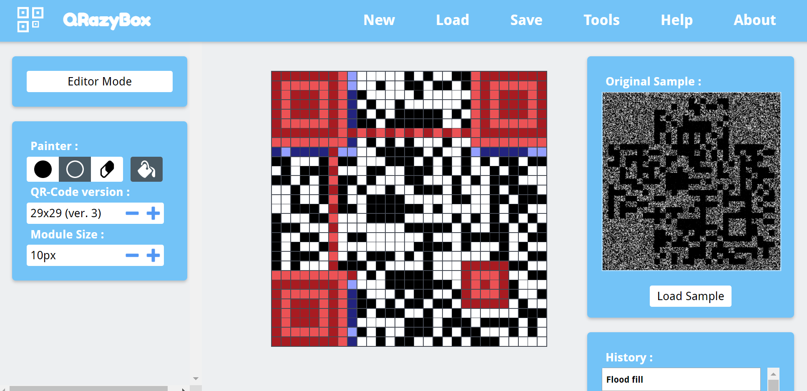
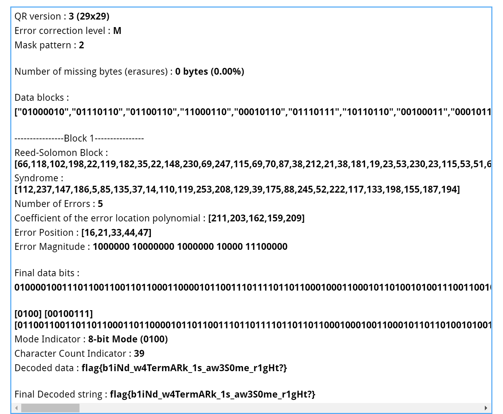
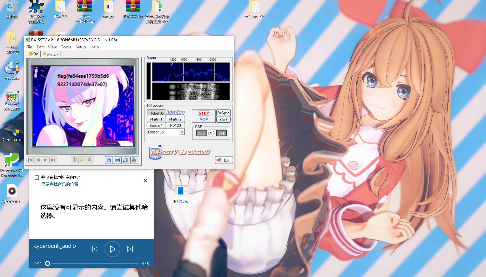

## ShuoDeDaoLi
文件尾字符串 string 或者 hexeditor都行

## QR or not QR

pngcheck可以确认这是个发育极度正常的png文件，修改文件结构隐写的概率很低。  

stegsolve可以看到低位有东西，但zsteg梭不出来，说明大概率隐写的是图片像素不是文本/文件。  

试了  
https://github.com/linyacool/blind-watermark  
https://github.com/fire-keeper/BlindWatermark  
https://github.com/chishaxie/BlindWaterMark  
都不行，看纹理也不像FFT之类的但还是试了试，还有低位高位反转，结果也不是  

然后再去看文件名 QR `or` `not` QR，考虑是通过组合二值化的通道位运算隐写，写脚本试了各种位运算组合也没成功。  

最后在全栈姐姐的提醒下用 https://github.com/guofei9987/blind_watermark 做出来了...
```python
from blind_watermark import WaterMark

bwm1 = WaterMark(password_wm=1, password_img=1)
# notice that wm_shape is necessary
bwm1.extract(filename='qr_or_not_qr.png', wm_shape=(310, 310), out_wm_name='aextracted.png', )
```

懒得补定位点了，去QRBOX扫:  

  

  


## Cyberpunk Audio

隐验定振，音频最后部分是SSTV  

  
