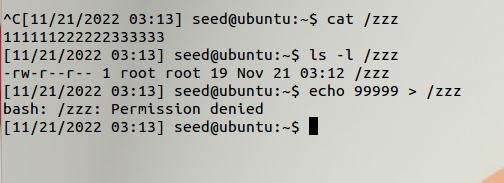
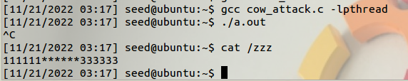
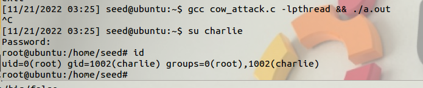

## Task 1: Modify a Dummy Read-Only File
脏牛是著名的竞争提权漏洞，即在Copy On Write的Copy结束，页表切换结束，Write未开始时通过发送`madvise`将指向dirty copy的页表切回原页表，此时的内容会被写入原先不可读的文件。  

因为COW是内核进行的，所以需要多线程发送madvise来达到上述的竞争条件。  

这样可以通过修改只读的`/etc/passwd`清空root密码，或者更改自己的uid等完成提权。  

### 2.1 Create a Dummy File

按照要求创建一个权限为644的文件，sudo写入并尝试读取：  
（644意味着对root rw，对自己和其他用户r，也就是每3bit对应一个特权的RWX位）  
  

### 2.2 Set Up the Memory Mapping Thread

按照要求编译并运行脏牛，几秒后终止： 
  

可见成功写入了本应是只读的 `/zzz`

## Task 2: Modify the Password File to Gain the Root Privilege

写入的内容改为root的uid：
```c
char *content= "0000";
```
目标文件改为存放权限信息的`/etc/passwd`：
```c
int f=open("/etc/passwd", O_RDONLY);
```
查找的文本偏移改为charlie的uid：
```c
char *position = strstr(map, "1001"); 
```

编译运行，顺利拿到了rootshell：  
  
