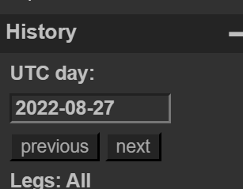

# Week9
## Emo
去flightradar24.com开会员应该能找到，或者三个月内可以嫖flightaware的，但是后者最近炸了  
用https://globe.adsbexchange.com/ 搜flightaware搜到的注册号780B86
  
History输入日期直接找到起降机场   
然后航旅纵横锁定日期和起降机场只能找到一个川航的航班  

flag{成都-厦门-3U6953}

## Travel Photo
有GPS信息，百度识图也直接能找到
flag{厦门-鼓浪屿}

## Home
图片里会所的名字地图直接搜就能找到，或者EXIF的GPS信息也能找到，然后发现拍照方向好像只有一个高楼就是  

flag{铜陵武庙朝圣楼}

## Football
识图能找到球员，有的新闻里给出评注是他的首秀   
继续搜新闻就能找到比赛的球场   
flag{2016-02-25-老特拉福德球场}
