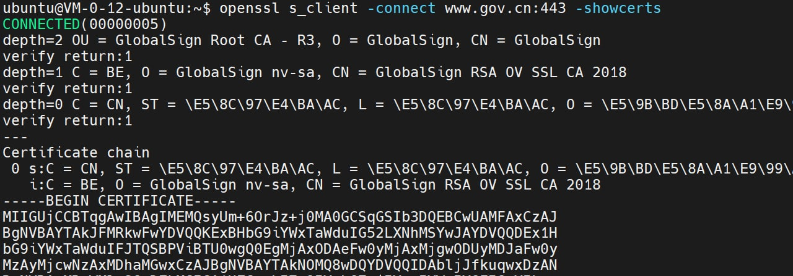
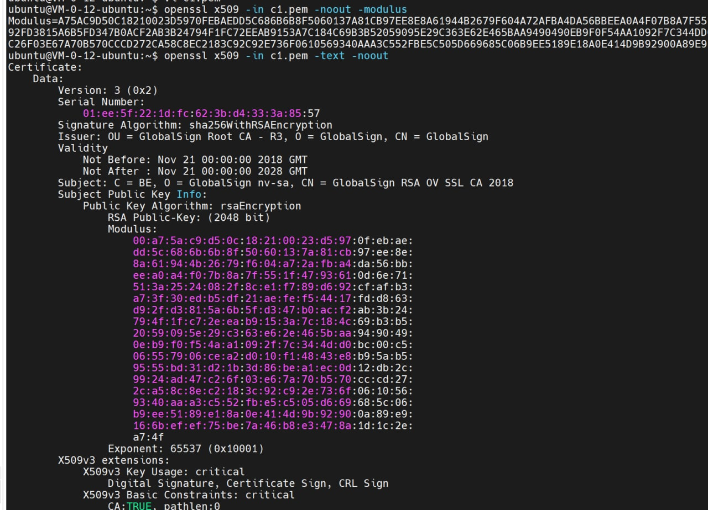
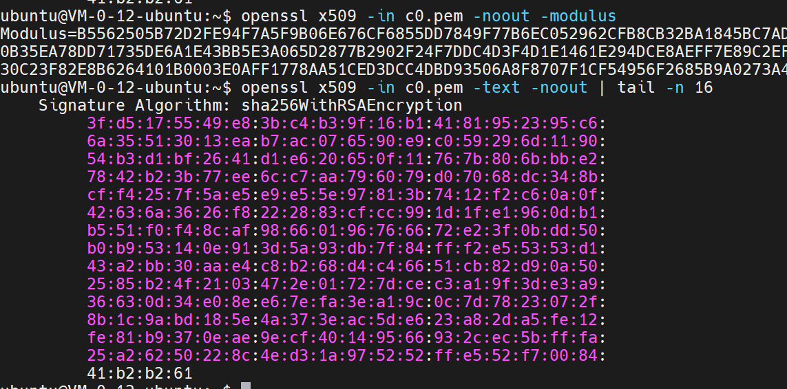
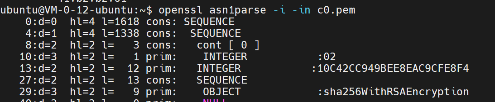

## Task 1: Deriving the Private Key

使用原生支持大数运算的python，用Crypto.Util.number库求逆元：  
(因M神提醒连夜加上`pow(e, -1, phi)`)
```python
from Crypto.Util.number import *

p = 0xF7E75FDC469067FFDC4E847C51F452DF
q = 0xE85CED54AF57E53E092113E62F436F4F
e = 0xD88C3
phi = (p - 1) * (q - 1)
d = inverse(e, phi)
print(f'hex(d) = {hex(d)}\ndec(d) = {d}')
```

运行结果是：
```python
hex(d) = 0x3587a24598e5f2a21db007d89d18cc50aba5075ba19a33890fe7c28a9b496aeb
dec(d) = 24212225287904763939160097464943268930139828978795606022583874367720623008491
```

## Task 2: Encrypting a Message

```python
from Crypto.Util.number import *

n = 0xDCBFFE3E51F62E09CE7032E2677A78946A849DC4CDDE3A4D0CB81629242FB1A5
e = 0x10001
M = bytes_to_long(b"A top secret!")
c = pow(M, e, n)
print(f'hex(c) = {hex(d)}\ndec(c) = {d}')
```

运行结果是：
```python
hex(c) = 0x6fb078da550b2650832661e14f4f8d2cfaef475a0df3a75cacdc5de5cfc5fadc
dec(c) = 50518525371929684556329211359721949099156057889496242376979402393388933577436
```


## Task 3: Decrypting a Message
```python
from Crypto.Util.number import *

C = 0x8C0F971DF2F3672B28811407E2DABBE1DA0FEBBBDFC7DCB67396567EA1E2493F
d = 0x74D806F9F3A62BAE331FFE3F0A68AFE35B3D2E4794148AACBC26AA381CD7D30D
e = 0x10001
m = pow(C, d, n)
print(long_to_bytes(m))
```

运行结果是：
```python
b'Password is dees'
```

## Task 4: Signing a Message
$s = M^d\ mod\ n$
```python
from Crypto.Util.number import *

n = 0xDCBFFE3E51F62E09CE7032E2677A78946A849DC4CDDE3A4D0CB81629242FB1A5
d = 0x74D806F9F3A62BAE331FFE3F0A68AFE35B3D2E4794148AACBC26AA381CD7D30D
M = bytes_to_long(b"I owe you $2000.")
s = pow(M, d, n)
print(f'hex(s) = {hex(s)}\ndec(s) = {s}')

print('After change price to 3000:')
M = bytes_to_long(b"I owe you $3000.")
s = pow(M, d, n)
print(f'hex(s) = {hex(s)}\ndec(s) = {s}')
```

运行结果是：
```python
hex(s) = 0x55a4e7f17f04ccfe2766e1eb32addba890bbe92a6fbe2d785ed6e73ccb35e4cb
dec(s) = 38737955862331189402498387291363292989447215164396465065684612292997465629899
After change price to 3000:
hex(s) = 0xbcc20fb7568e5d48e434c387c06a6025e90d29d848af9c3ebac0135d99305822
dec(s) = 85377692333201951919213855180904627562313128428164207106465609485406786574370
```

## Task 5: Verifying a Signature
```python
from Crypto.Util.number import *

M = bytes_to_long(b"Launch a missile.")
S = 0x643D6F34902D9C7EC90CB0B2BCA36C47FA37165C0005CAB026C0542CBDB6802F
e = 0x010001
n = 0xAE1CD4DC432798D933779FBD46C6E1247F0CF1233595113AA51B450F18116115
m = pow(S, e, n)
print(long_to_bytes(m))
print(m == M)

print('After change last 2 bytes of signature to 0x3F:')
S = 0x643D6F34902D9C7EC90CB0B2BCA36C47FA37165C0005CAB026C0542CBDB6803F
m = pow(S, e, n)
print(long_to_bytes(m))
print(m == M)
```
运行结果是：
```python
b'Launch a missile.'
True
After change last 2 bytes of signature to 0x3F:
b"\x91G\x19'\xc8\r\xf1\xe4,\x15O\xb4c\x8c\xe8\xbcrm=f\xc8:N\xb6\xb7\xbe\x02\x03\xb4\x1a\xc2\x94"
False
```

## Task 6: Manually Verifying an X.509 Certificate

### Step 1: Download a certificate from a real web server

使用课件的命令 
```bash
openssl s_client -connect www.gov.cn:443 -showcerts
```
 获取 `gov.cn` 的证书链详情  

  

### Step 2: Extract the public key (e, n) from the issuer’s certificate

使用课件的命令导出CA的公钥和详情  
```bash
openssl x509 -in c1.pem -noout -modulus
openssl x509 -in c1.pem -text -noout
```

  


### Step 3: Extract the signature from the server’s certificate

使用课件的命令导出网站证书的签名和网站的公钥  
```bash
openssl x509 -in c0.pem -text -noout  | tail -n 16
```

  


### Step 4: Extract the body of the server’s certificate

偏移量没有变化：
  


>$ openssl asn1parse -i -in c0.pem -strparse 4 -out c0_body.bin -noout  
>$ sha256sum c0_body.bin  
>f2bfa1337ec741294ca709cc974e99968821e3dfc948cbf09045fd46607a52a5  c0_body.bin  

### Step 5: Verify the signature

验证颁发者的签名：  
**即使用颁发者的公钥(Step 2中导出的Modulus)验证其签名(Step 3中导出的Signature)是否符合签名内容(Step 4中计算的哈希)**  

```python
sign = 0x3fd5175549e83bc4b39f16b14181952395c66a35513013eab7ac076590e9c059296d119054b3d1bf2641d1e620650f11767b806bbbe27842b23b77ee6cc7aa796079d07068dc348bcff4257f5ae5e9e55e97813b7412f2c60a0f42636a3626f8222883cfcc991d1fe1960db1b551f0f48caf98660196766672e23f0bdd50b0b953140e913d5a93db7f84fff2e55353d143a2bb30aae4c8b268d4c46651cb82d90a502585b24f2103472e01727dcec3a19f3de3a936630d34e08ee67efa3ea19c0c7d7823072f8b1c9abd185e4a373eac5de623a82da5fe12fe81b9370eae9ecf40149566932cec5bfffa25a26250228c4ed31a975252ffe552f7008441b2b261
e = 65537
n = 0xA75AC9D50C18210023D5970FEBAEDD5C686B6B8F5060137A81CB97EE8E8A61944B2679F604A72AFBA4DA56BBEEA0A4F07B8A7F551F4793610D6E71513A2524082F8CE1F789D692CFAFB3A73F30EDB5DF21AEFEF54417FDD863D92FD3815A6B5FD347B0ACF2AB3B24794F1FC72EEAB9153A7C184C69B3B52059095E29C363E62E465BAA9490490EB9F0F54AA1092F7C344DD0BC00C506557906CEA2D010F14843E8B95AB59555BD31D21B3D86BEA1EC0D12DB2C9924AD47C26F03E67A70B570CCCD272CA58C8EC2183C92C92E736F0610569340AAA3C552FBE5C505D669685C06B9EE5189E18A0E414D9B92900A89E9166BEFEF75BE7A46B8E3478A1D1C2EA74F
body_hash = 0xf2bfa1337ec741294ca709cc974e99968821e3dfc948cbf09045fd46607a52a5

m = pow(sign, e, n)
print(hex(m))
print(int(hex(m)[-64:], 16) == body_hash)
```

输出为
```python
0x1ffffffffffffffffffffffffffffffffffffffffffffffffffffffffffffffffffffffffffffffffffffffffffffffffffffffffffffffffffffffffffffffffffffffffffffffffffffffffffffffffffffffffffffffffffffffffffffffffffffffffffffffffffffffffffffffffffffffffffffffffffffffffffffffffffffffffffffffffffffffffffffffffffffffffffffffffffffffffffffffffffffffffffffffffffffffffffffffffffffffffffffffffffffffffffffffffffffffffffffffffffff003031300d060960864801650304020105000420f2bfa1337ec741294ca709cc974e99968821e3dfc948cbf09045fd46607a52a5
True
```  

说明签名是符合的