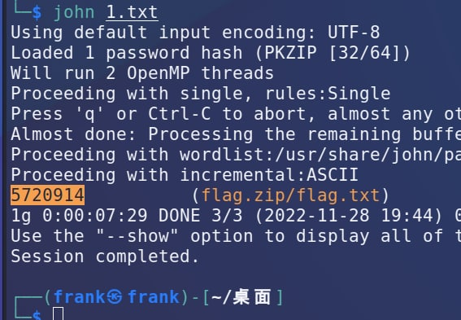

# week 10 wp

## TinyECC
很典的例题，但是ECC菜菜，丢john做了。
  


## RSABCD
pq非常接近，费马脚本一把梭

```python
from gmpy2 import *
from Crypto.Util.number import *

n = 130941568761713716392020133316873966072238970278533892429363030575842745610100511393085082040748038166925516284710947247073454902685165791843432701473350030388915420950513638071917718126233634161552696945279139445130776512819883613454994716182044557686704822551356436790993822890402208662836454810890517057233
c = 111979600889559171366355441329992905814620627146798523557636833300899744100576774242668239860358518667580542869343399143749149539698124086509794428145266794562419372716892074583591959044685606788189534831989592497052248270771896351216996522714267684794498081032475683284396222478147307210959206877422498877242
e = 65537


def fermat_factorization(n):
    factor_list = []
    get_context().precision = 2048
    x = int(sqrt(n))
    while True:
        x += 1
        y2 = x ** 2 - n
        if is_square(y2):
            get_context().precision = 2048
            y = int(sqrt(y2))
            factor_list.append([x + y, x - y])
        if len(factor_list) == 2:
            break
    return factor_list


factor_list = fermat_factorization(n)
[X1, Y1] = factor_list[0]
[X2, Y2] = factor_list[1]
assert X1 * Y1 == n
assert X2 * Y2 == n
p1 = gcd(X1, X2)
q1 = X1 // p1
p2 = gcd(Y1, Y2)
q2 = Y1 // p2
phi = (p1 - 1) * (q1 - 1) * (p2 - 1) * (q2 - 1)
d = inverse(e, phi)
flag = long_to_bytes(pow(c, d, n))
print(flag)
```